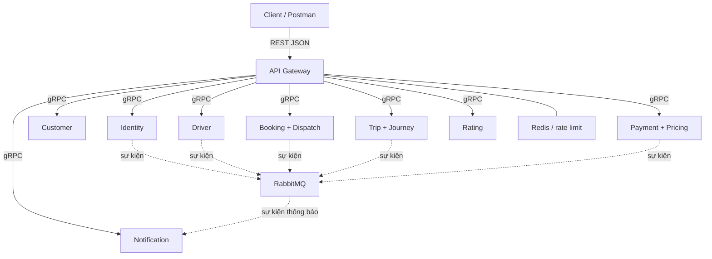

# CAB System Thiết kế tám microservice và đối chiếu phiếu chấm

**Phiên bản:** 1.3  
**Trạng thái:** Nội dung thiết kế đã được chủ dự án duyệt; các hợp đồng và quyết định còn mở được ghi tại mục 15.  
**Phạm vi:** Tám dịch vụ nghiệp vụ, API Gateway và hạ tầng triển khai local.  
**Căn cứ:** Bản Word Thiết Kế Micro-Service, phiếu PHIEU_CHAM_PROJECT, bộ API YAML local và quyết định giữ tám MS của chủ dự án.

Tài liệu xác định kiến trúc, quyền sở hữu dữ liệu, cách phối hợp nghiệp vụ và bằng chứng cần chuẩn bị cho 30 tiêu chí chấm. Việc có đủ nội dung thiết kế không đồng nghĩa hệ thống đã triển khai hoặc kiểm thử đạt. Các hợp đồng mới và quyết định còn mở được ghi tại mục 15.

## 1. Phạm vi và các thay đổi so với bản Word

### 1.1. Phạm vi MVP

- Đăng ký Customer, đăng nhập, quản lý phiên, đổi mật khẩu và đăng xuất.
- Tra cứu Customer/Driver theo mã với phân quyền trên đối tượng.
- Driver đăng ký qua OTP, gửi hồ sơ, được OPERATOR duyệt hoặc từ chối.
- Quản lý phương tiện, phân công xe và bật/tắt nhận chuyến.
- Tìm Driver trong 1 km có limit và paging; tìm ứng viên điều phối theo cấu hình riêng.
- Tạo Booking, gửi offer, nhận/từ chối, tạo và thực hiện Trip.
- GPS, theo dõi chuyến, hủy hợp lệ và xử lý sự cố.
- Xác nhận dữ liệu hành trình, tính cước, thanh toán tiền mặt và online qua sandbox.
- Đánh giá chuyến hoàn tất và thông báo IN_APP.
- Gateway, IPC, Compose, healthcheck, bảo mật và minh chứng chấm thực hành.

### 1.2. Nội dung ngoài MVP

Chưa đưa vào baseline: voucher, phí hủy, hoàn tiền tự động, hóa đơn điện tử có tính pháp lý/VAT, quên mật khẩu, hạng thành viên, địa chỉ yêu thích, bảng xếp hạng và điểm trung bình tài xế, email giao dịch, Analytics Service và dashboard KPI tổng hợp.

SMS cho OTP được xem xét riêng theo yêu cầu tích hợp đăng ký Driver. Không đồng nhất SMS OTP với kênh thông báo nghiệp vụ. Socket.IO/WebSocket là tùy chọn giao diện; hộp thư IN_APP bền vững và API đọc thông báo vẫn phải hoạt động nếu kết nối realtime bị ngắt.

Audit nghiệp vụ vẫn bắt buộc trong từng dịch vụ dù Analytics nằm ngoài MVP. Báo cáo tổng hợp đang có trong API 07 phải được đánh dấu tùy chọn hoặc điều chỉnh phạm vi đồng bộ; không âm thầm xóa hợp đồng đã công bố.

### 1.3. Chuyển từ 11 dịch vụ về tám dịch vụ

| Trong bản Word | Quyết định của bản này |
|---|---|
| auth-service | Giữ Identity & Access Service |
| user-service | Đổi thành Customer Service; không sở hữu hồ sơ Driver hoặc trạng thái Account |
| driver-service | Giữ Driver & Fleet; bổ sung vị trí mới nhất và quyền giữ chỗ Driver/Vehicle |
| booking-service và dispatch-service | Gộp thành Booking Service, gồm module Booking và Dispatch |
| trip-service và tracking-service | Trip sở hữu hành trình và JourneyMetrics; Driver sở hữu vị trí mới nhất; không có Tracking MS riêng |
| payment-service | Sở hữu cấu hình giá, Fare và thanh toán; Booking lưu snapshot giá |
| rating-service | Giữ; đánh giá không phụ thuộc thanh toán thành công |
| notification-service | Giữ; ưu tiên hộp thư IN_APP bền vững |
| analytics-service | Ngoài MVP; audit gốc được ghi tại dịch vụ thực hiện thao tác |

Các mã UC trong bản Word chưa được coi là đã truy vết chính xác. Phải đối chiếu lại từng UC với SRS sau khi duyệt kiến trúc; không giữ liên kết UC sai chỉ để đủ bảng.

## 2. Miền nghiệp vụ và ngôn ngữ thống nhất

### 2.1. Ranh giới nghiệp vụ

| Miền | Năng lực | Dịch vụ triển khai |
|---|---|---|
| Identity & Access | Account, xác thực, OTP, Role, Session | identity-service |
| Customer | Hồ sơ khách và quyền có công việc đang hoạt động | customer-service |
| Driver & Fleet | Driver, hồ sơ đăng ký, xe, phân công, vị trí mới nhất, khả năng nhận chuyến | driver-service |
| Booking & Dispatch | Đặt xe, lựa chọn ứng viên, offer và điều phối phân công | booking-service |
| Trip & Journey | Trạng thái chuyến, hành trình, sự cố và xác nhận metrics | trip-service |
| Pricing & Payment | Cấu hình giá, Fare, nghĩa vụ thanh toán, Attempt và đối soát | payment-service |
| Rating | Đánh giá chuyến đi | rating-service |
| Notification | Nhận sự kiện và công bố thông báo | notification-service |

Booking/Dispatch và Trip là miền cốt lõi của bản CAB này. Cách phân loại DDD phục vụ giải thích thiết kế, không quyết định số container. Một dịch vụ có thể chứa nhiều module liên quan nhưng mỗi dữ liệu có một nơi có thẩm quyền.

### 2.2. Thuật ngữ và trạng thái

| Đối tượng | Giá trị thống nhất |
|---|---|
| Role | CUSTOMER, DRIVER, OPERATOR; không bổ sung ADMIN như vai trò thứ tư |
| Account | ACTIVE, INACTIVE, SUSPENDED |
| Driver approval | PENDING_APPROVAL, APPROVED, REJECTED |
| Driver activity | AVAILABLE, BUSY, OFFLINE |
| DriverApplication | SUBMITTED, APPROVED, REJECTED |
| Vehicle | ACTIVE, INACTIVE |
| VehicleType | STANDARD, PREMIUM, MOTORBIKE, VAN theo YAML hiện tại |
| Booking | PENDING, FINDING_DRIVER, DRIVER_ASSIGNED, NO_DRIVER_FOUND, CANCELLED |
| DispatchProcess | SEARCHING, DRIVER_FOUND, NO_DRIVER_AVAILABLE, CANCELLED |
| TripRequest | PENDING, ACCEPTED, REJECTED, EXPIRED, CANCELLED |
| Trip | DRIVER_ASSIGNED, ARRIVED_PICKUP, PICKED_UP, IN_PROGRESS, COMPLETED, CANCELLED, ERROR |
| Payment/PaymentAttempt | PENDING, PROCESSING, SUCCESS, FAILED, UNKNOWN |
| Incident | OPEN, RESOLVED |
| Notification | deliveryStatus=PENDING/SENT/FAILED; isRead là thuộc tính riêng |

Admin trong rubric tương ứng OPERATOR; Payment COMPLETED trong rubric tương ứng Payment SUCCESS; Ride CANCELED tương ứng Trip CANCELLED. Online không có nghĩa luôn nhận được chuyến: chỉ Driver AVAILABLE và đủ điều kiện mới được chọn.

Không dùng is_active hoặc is_approved dạng boolean để thay các trạng thái có nhiều giá trị. Không thay danh mục VehicleType bằng Sedan/SUV/Van nếu chưa sửa SRS và API. Các trạng thái Saga kỹ thuật được giữ riêng, không tự thêm vào enum công khai.

## 3. Kiến trúc và giao tiếp

### 3.1. Thành phần

Tám MS nghiệp vụ chạy độc lập sau API Gateway. Gateway, Redis, PostgreSQL và RabbitMQ không được tính thành MS nghiệp vụ.

Client gọi REST/JSON qua Gateway. Gateway chuyển tới phương thức gRPC nội bộ. Các lời gọi đồng bộ cần lấy dữ liệu có thẩm quyền dùng gRPC; sự kiện sau commit và công việc có thể xử lý trễ dùng RabbitMQ.

Không áp dụng quy tắc mọi nghiệp vụ quan trọng chỉ được dùng event. Ví dụ, xác minh Session, giữ chỗ tài xế hoặc xác minh điều kiện Rating cần kết quả có thẩm quyền và xử lý khi không lấy được kết quả.

Gateway-to-service gRPC là thiết kế đề xuất; cần bổ sung .proto. Các API REST công khai không tự đổi URL hoặc mã phản hồi chỉ vì thay giao thức phía trong.



Sơ đồ biểu diễn cửa vào và luồng thông báo chính; các RPC liên dịch vụ và consumer phục hồi khác được liệt kê tại mục 3.4 và mục 6. Mỗi MS nối tới database riêng theo mục 4, không dùng một database nghiệp vụ chung. Redis là hạ tầng, không là nơi sở hữu Account/Session gốc.

### 3.2. Context map

- Identity cung cấp hợp đồng xác minh Account/Session cho Gateway và các dịch vụ có quyền gọi.
- Customer, Driver, Trip và Payment cung cấp phương thức nội bộ cần thiết cho Booking; Booking điều phối phân công, không cập nhật database của chúng.
- Trip cung cấp ngữ cảnh chuyến cho Rating và dữ liệu tính cước cho Payment.
- Notification tiêu thụ sự kiện từ nguồn được cho phép; không nhận quyết định nghiệp vụ từ client.
- Payment dùng adapter chuyển đổi hợp đồng nhà cung cấp; timeout hoặc tên trạng thái provider không được diễn giải tùy tiện thành kết quả nội bộ.
- RabbitMQ truyền thông điệp, không thay thế quy tắc xử lý nhất quán.

### 3.3. Gateway

- Chỉ Gateway công bố cổng HTTP ứng dụng ra host; backend và hạ tầng ở mạng nội bộ Docker.
- Có allowlist theo method và path; không proxy toàn bộ đường dẫn đến một dịch vụ.
- Các route cụ thể như /drivers/me, /drivers/nearby, /trips/{id}/rating và /trips/{id}/payment được xét trước route tổng quát.
- Chặn cả /internal/* và thao tác nội bộ có đường dẫn /v1; không chỉ dựa vào tiền tố.
- Kiểm tra token, Account/Session, giới hạn request, body size, timeout và correlationId.
- Loại bỏ header giả mạo danh tính do client gửi. Dịch vụ đích xác thực caller và quyền trên đối tượng.
- Không tự retry request ghi nếu chưa có khóa chống trùng.
- Webhook vẫn đi qua Gateway; giữ raw body và header cần cho xác minh chữ ký.
- Đăng ký, login, OTP và webhook được miễn user token đúng hợp đồng nhưng có kiểm soát tương ứng.
- Nếu bật WebSocket sau này, kết nối cũng qua Gateway, xác thực người dùng và kiểm tra quyền từng phòng/chuyến.

### 3.4. Hợp đồng nội bộ

Mọi RPC có deadline hữu hạn, correlationId và danh tính dịch vụ. RPC ghi có operationId/idempotency key và version hoặc reservation token khi cần. Retry chỉ cho thao tác đọc hoặc ghi đã idempotent; có backoff, jitter và giới hạn.

| Hợp đồng cần đặc tả | Bên gọi | Bên sở hữu |
|---|---|---|
| Xác minh Account/Session và vai trò hiện tại | Gateway, dịch vụ nghiệp vụ | Identity |
| Tạo/tra cứu Customer profile, giữ/gắn/giải phóng ActivityGuard | Identity, Booking, Trip | Customer |
| Tạo hồ sơ Driver; đọc điều kiện, giữ/xác nhận/giải phóng Driver và Vehicle | Identity, Booking, Trip | Driver |
| Lấy giá hiệu lực và snapshot giá | Booking | Payment |
| Chuẩn bị/kích hoạt/hủy phần chuẩn bị Trip; tra cứu kết quả | Booking | Trip |
| Lấy ngữ cảnh chuyến cho Rating, quyền xác nhận tiền mặt và metrics | Rating, Payment | Trip |

Tên bảng này mô tả trách nhiệm, chưa phải tên RPC hoặc scope đã được triển khai. Mapping lỗi gRPC sang HTTP phải được viết trong Gateway và test, không trả lỗi nội bộ nguyên dạng cho client.

## 4. Quyền sở hữu và lưu trữ dữ liệu

Chọn PostgreSQL với UUID cho tám database logic: cab_identity, cab_customer, cab_driver, cab_booking, cab_trip, cab_payment, cab_rating, cab_notification. Có thể cùng một PostgreSQL server khi chạy local. Mỗi dịch vụ có runtime role riêng, không quyền đọc/ghi database khác; migration role được giới hạn riêng.

Không trộn mô tả UUID/ObjectId hoặc chỉ mục MongoDB 2dsphere vào mô hình PostgreSQL. Bản đầu có thể lưu latitude/longitude có kiểm tra phạm vi và tính khoảng cách bằng công thức nhất quán. Redis GEO là dữ liệu hỗ trợ có thể dựng lại; không là nguồn quyết định phân công cuối cùng. Nếu chọn PostGIS sau này, phải ghi rõ extension, kiểu geography và chỉ mục GiST, không gọi đó là 2dsphere.

| Dữ liệu | Chủ sở hữu có thẩm quyền |
|---|---|
| Account, fullName, email/phone, password, trạng thái và Session | Identity |
| Customer profile, liên kết accountId và CustomerActivityGuard | Customer |
| Driver profile, license, approval, xe, VehicleAssignment, DriverLocation và DriverReservation | Driver |
| Booking, snapshot giá đã chấp nhận, DispatchProcess, TripRequest, AssignmentSaga | Booking |
| Trip, lịch sử, Incident, TripRoutePoint, JourneyMetrics và đóng chuyến | Trip |
| PricingConfig phiên bản, Fare, Payment, Attempt, ProviderEvent | Payment |
| Rating gốc | Rating |
| Notification, InboxReceipt và job công bố | Notification |

ID liên dịch vụ là tham chiếu logic, không khóa ngoại xuyên database. Snapshot hoặc projection phải ghi nguồn, version và độ mới; không cập nhật độc lập như một bản gốc thứ hai.

## 5. Mô hình dữ liệu tối thiểu

Các bảng dưới đây xác định thực thể và ràng buộc cần có. Kiểu timestamp là thời gian UTC có múi giờ; API dùng định dạng thời gian đã thống nhất. Không xem bảng này là migration hoàn chỉnh.

### 5.1. Identity

| Entity | Thuộc tính và ràng buộc chính |
|---|---|
| Account | accountId; fullName; emailEncrypted, phoneEncrypted; emailLookupHash, phoneLookupHash duy nhất; passwordHash; role; accountStatus; version; createdAt, updatedAt |
| Session | sessionId, accountId, refreshTokenHash, expiresAt, revokedAt, rotatedAt, createdAt; không lưu refresh token dạng rõ |
| OtpChallenge | challengeId, phoneEncrypted/lookupHash, purpose, codeDigest, expiresAt, failedAttempts, verifiedAt, invalidatedAt |
| PhoneVerification | verificationId, challengeId, phoneLookupHash, tokenDigest, expiresAt, consumedAt |
| RegistrationOperation | operationId, accountId, loại hồ sơ đích, trạng thái cấp phát, kết quả từng bước, idempotency, thời điểm và lỗi an toàn |

Chuẩn hóa phone theo E.164 thay vì bắt buộc đúng 10 ký tự; email trim/lowercase trước tạo HMAC. fullName không rỗng sau trim; password không tự trim. Account một vai trò. OPERATOR được cấp qua quy trình quản trị/seed, không đăng ký công khai.

Session hỗ trợ thu hồi và luân chuyển refresh token. Logout thu hồi phiên; đổi mật khẩu hoặc khóa Account thu hồi phiên liên quan. Token chưa hết hạn không được bỏ qua Account đã khóa hoặc Session đã thu hồi.

### 5.2. Customer

| Entity | Thuộc tính và ràng buộc chính |
|---|---|
| Customer | customerId, accountId duy nhất, createdAt, updatedAt; Account phải có role CUSTOMER |
| CustomerActivityGuard | customerId duy nhất, ownerOperationId, bookingId, tripId, version và thời điểm; tối đa một công việc đang hoạt động |

Không lưu một bộ email/phone/fullName có thể sửa độc lập với Identity. Chưa thêm avatar, saved_addresses hoặc emergency_phone khi hợp đồng hiện tại chưa có. Trip đóng nhưng còn nợ Payment không tự ngăn đặt chuyến mới.

### 5.3. Driver và Fleet

| Entity | Thuộc tính và ràng buộc chính |
|---|---|
| Driver | driverId, accountId duy nhất, licenseNumberEncrypted, licenseLookupHash duy nhất, approvalStatus, driverStatus, rejectionReason, version |
| DriverApplication | applicationId, driverId, snapshot khai báo xe, status, version, submittedAt, reviewedAt, reviewedByAccountId, rejectionReason |
| Vehicle | vehicleId, plateNumber, normalizedPlateKey duy nhất, vehicleType, vehicleStatus, version |
| VehicleAssignment | assignmentId, driverId, vehicleId, startedAt, endedAt, assignedByAccountId; chỉ một phân công chưa kết thúc cho mỗi Driver và Vehicle |
| DriverLocation | driverId, latitude, longitude, recordedAt, receivedAt; không cho mẫu cũ ghi đè mẫu mới |
| DriverReservation | reservationId, assignmentId, driverId, vehicleId, bookingId, tripId, generation, state, thời hạn giữ tạm; tối đa một quyền hoạt động cho mỗi Driver/Vehicle |

Không dùng vehicles.driver_id vừa làm sở hữu vừa làm lịch sử phân công. Duyệt tài xế không tự bật AVAILABLE. Xe và tài xế đang phục vụ Trip không được đổi phân công.

### 5.4. Booking và Dispatch

| Entity | Thuộc tính và ràng buộc chính |
|---|---|
| BookingRequest | bookingId, customerId, pickup, destination, vehicleType, note, bookingStatus, pricingVersionId, pricingSnapshot, driverId, tripId, version, cancellation, createdAt, updatedAt |
| DispatchProcess | dispatchProcessId, bookingId duy nhất, trạng thái, attemptedDriverIds, attemptCount, startedAt, deadlineAt, configSnapshot, endedAt |
| TripRequest | tripRequestId, bookingId, driverId, dispatchProcessId, status, sentAt, expiresAt, resolvedAt, rejectReason/closureReason, tripId |
| AssignmentSaga | assignmentId, bookingId, tripId ổn định, trạng thái, reservation token, version, yêu cầu hủy, kết quả từng bước và công việc phục hồi |

Tối đa một offer PENDING mỗi tiến trình; không thử lại cùng Driver trong một tiến trình; expiresAt không vượt deadlineAt. Restart không đặt lại thời hạn hoặc số lượt. Redis lock không thay các ràng buộc này.

### 5.5. Trip và hành trình

| Entity | Thuộc tính và ràng buộc chính |
|---|---|
| Trip | tripId, bookingId duy nhất, assignmentId, customerId, driverId, vehicleId và snapshot, pricingSnapshot, tripStatus, version, arrivedAt, pickedUpAt, startedAt, completedAt, closedAt, closeReason, statusBeforeError, cancellation |
| TripPreparation | assignmentId duy nhất, tripId, generation, trạng thái chuẩn bị/kích hoạt/hủy; lưu tombstone để lệnh đến muộn không hồi sinh phần đã hủy |
| TripStatusHistory | tripId, version, previousStatus, newStatus, actor, changedAt và reason |
| IncidentRecord | incidentId, tripId, issueType, status, reportedByAccountId, resolutionAction/note, resolvedByAccountId và timestamps |
| TripRoutePoint | sampleId, tripId, driverId, latitude, longitude, recordedAt, receivedAt; khóa chống trùng mẫu |
| JourneyMetrics | tripId, metricsVersion, distanceKm, durationMinutes, qualityStatus, calculationMethodVersion, confirmedAt, reviewReason |
| ClosureOperation | operationId, tripId, closureVersion và kết quả giải phóng Customer/Driver |

Trip ERROR chưa đóng vẫn giữ tài nguyên. GPS không tăng version trạng thái Trip. Mẫu chưa có không được biểu diễn như actual_distance=0/actual_duration=0 đã xác nhận.

### 5.6. Pricing và Payment

| Entity | Thuộc tính và ràng buộc chính |
|---|---|
| PricingConfig | pricingVersionId, vehicleType, currency, baseFare, pricePerKm, pricePerMinute, effectiveFrom, reason, createdByAccountId; unique vehicleType + effectiveFrom |
| Fare | fareId, tripId duy nhất, pricingSnapshot, metricsVersion, distanceKm, durationMinutes, các thành phần tiền, totalAmount, calculatedAt |
| Payment | paymentId, tripId/fareId duy nhất, customerId, amount, currency, method, paymentStatus, currentAttemptId, requiresReview, version, paidAt, confirmedByAccountId |
| PaymentAttempt | attemptId, paymentId, attemptNumber, method, status, amount, provider, merchantReference, providerTransactionId, failureCode, resolvedAt; unique paymentId + attemptNumber |
| ProviderEvent | provider + providerEventId duy nhất, attemptId, verifiedResult, processingStatus và evidenceReference |

Đơn giá và số tiền trung gian dùng NUMERIC/decimal chính xác, không Double/float. VND cuối cùng là số nguyên sau làm tròn tổng, nửa lên với số không âm. Không cập nhật đè biểu giá đã được snapshot hoặc Fare đã chốt.

Một Payment có nhiều Attempt lịch sử nhưng không hai Attempt hoạt động đồng thời; UNKNOWN vẫn chặn lần mới. Payment SUCCESS không bị hạ xuống FAILED. Chỉ cho đổi sang CASH khi lần online trước đã được xác minh không thể thu tiền nữa và không còn điều kiện review ngăn chuyển.

### 5.7. Rating

Rating gồm ratingId, tripId duy nhất, customerId, driverId lịch sử, score nguyên 1..5, comment và createdAt. Customer phải sở hữu Trip COMPLETED. Không yêu cầu Payment SUCCESS. Không thêm sửa/xóa Rating, averageScore hoặc leaderboard vào MVP.

### 5.8. Notification

Notification gồm notificationId, eventId, recipientAccountId, eventType, referenceType/id, channel=IN_APP, title, message, deliveryStatus, isRead, readAt, publishedAt và timestamps. Unique eventId + recipientAccountId + channel.

InboxReceipt có eventId duy nhất toàn hệ thống, source, schemaVersion, contentDigest, payload tối thiểu và trạng thái. Consumer name chỉ để truy vết. Cùng eventId khác nội dung là xung đột, không ghi đè.

Hộp thư chỉ trả SENT của người đang đăng nhập; SENT nghĩa là đã công bố bền vững. Đánh dấu đọc giữ readAt lần đầu; sự kiện phát lại không đặt isRead=false.

### 5.9. Hạ tầng dữ liệu của từng dịch vụ

- IdempotencyRecord: danh tính + operation + key duy nhất, requestDigest, trạng thái, HTTP result hoặc kết quả RPC, resourceId và thời điểm. Không lưu password/token/raw request nhạy cảm.
- OutboxEvent: eventId, eventType, schemaVersion, source, aggregateId/version, correlationId, occurredAt, payload đóng băng và trạng thái phát.
- Saga/BackgroundJob: bước đã commit, nextRunAt, attempts, lease/generation, lỗi an toàn và bằng chứng kết quả.
- AuditLog: người/dịch vụ thực hiện, action, entityId, correlationId, thời gian, thay đổi đã che dữ liệu nhạy cảm. Runtime role không được sửa/xóa audit thông thường. Default NOW hoặc trường Immutable trong tài liệu không tự bảo đảm tính bất biến.

## 6. Luồng nghiệp vụ và phục hồi liên dịch vụ

### 6.1. Nguyên tắc Saga

Một transaction chỉ bao phủ một database của một dịch vụ. Saga ghi bền vững từng bước, chống trùng, xác minh khi mất phản hồi và có thao tác bù có điều kiện. Không giữ transaction khi chờ RPC/provider.

Trạng thái kỹ thuật đề xuất: RUNNING, WAITING_RETRY, COMPENSATING, SUCCEEDED, COMPENSATED, MANUAL_REVIEW. Mọi lệnh đến muộn đối chiếu operationId/generation; coordinator cũ không được ghi đè tiến trình mới.

Timeout không chứng minh lệnh chưa thực hiện. Retry dùng cùng ID; chỉ bù khi đã xác minh trạng thái phù hợp. Không xóa Trip đang hoạt động để giả lập rollback.

### 6.2. Đăng ký và đăng nhập

Identity điều phối đăng ký. Lưu Account và RegistrationOperation với trạng thái cấp phát nội bộ chưa xong; Customer/Driver tạo hồ sơ idempotently; Identity chỉ hoàn tất sau xác nhận hồ sơ. Không trả đăng ký thành công đầy đủ hoặc cấp phiên sử dụng đầy đủ khi hồ sơ bắt buộc chưa có.

Driver đi qua OTP và PhoneVerification. Việc tiêu thụ token và ghi operation là transaction tại Identity; việc tạo Driver PENDING_APPROVAL/OFFLINE và Application SUBMITTED là transaction tại Driver. Khôi phục bằng cùng operationId, không tiêu thụ token lần hai. Replay phải chứng minh đúng token digest, key và request; không chỉ biết key là đọc được kết quả.

Login kiểm tra mật khẩu, trạng thái Account và cấp phát hồ sơ; tạo Session rồi cấp token. Driver chờ duyệt hoặc bị từ chối vẫn được xem hồ sơ của mình khi Account ACTIVE, nhưng không bật AVAILABLE.

### 6.3. Tạo Booking

Booking ghi tiến trình với bookingId ổn định, yêu cầu Customer giữ ActivityGuard và lấy snapshot giá từ Payment. Sau đó tạo Booking, công việc Dispatch, idempotency và outbox trong cab_booking.

Chỉ giải phóng guard khi chắc chắn tiến trình thất bại và guard còn thuộc đúng operation. Booking đã commit thì tiếp tục phục hồi/phát sự kiện, không bù vì mất phản hồi cho client. Hai key khác nhau của cùng Customer vẫn bị guard chặn.

### 6.4. Tìm Driver và gửi offer

Booking/Dispatch lấy ứng viên từ Driver theo Account ACTIVE, APPROVED, AVAILABLE, xe hợp lệ/ACTIVE, đúng loại xe, GPS còn mới và không bị reservation/Trip chiếm.

Nearby công khai phải hỗ trợ bán kính 1 km, limit và paging. Bán kính dispatch 5 km, offer 30 giây và tối đa 5 lượt trong bản Word là cấu hình đề xuất cần đối chiếu SRS/API trước khi chốt, không phải con số rubric bắt buộc.

Lưu deadlineAt, attemptedDriverIds và từng TripRequest. Worker chốt quá hạn bằng thời gian máy chủ; không dựa vào việc key Redis biến mất. Driver có thể truy vấn offer qua API dù thông báo realtime bị chậm.

### 6.5. Nhận chuyến

Booking là coordinator và có một điểm quyết định tranh chấp accept/cancel trong cab_booking.

1. Kiểm tra TripRequest, Driver, thời hạn và quyền; giành quyền phân công bằng version/cập nhật có điều kiện.
2. Driver giữ nguyên tử Driver và Vehicle, trả reservationId/generation. Driver khác hoặc Booking khác không chiếm được cùng tài nguyên.
3. Trip chuẩn bị chuyến bằng assignmentId và bookingId duy nhất; chưa công bố chuyến hoạt động.
4. Customer gắn guard hiện hữu với tripId; Driver chuyển reservation thành gán cho đúng tripId.
5. Trip kích hoạt khi có xác nhận hợp lệ của các bước giữ quyền. Các quyền đã xác nhận không tự hết hạn trong lúc kích hoạt.
6. Booking ghi DRIVER_ASSIGNED, TripRequest ACCEPTED, kết quả và outbox DRIVER_ASSIGNED.

Nếu lỗi trước kích hoạt: hủy TripPreparation có lưu tombstone, rồi giải phóng đúng reservation/guard theo quyết định tiến trình. Nếu chưa biết Trip đã kích hoạt, tra cứu trước khi bù. Khi Trip đã kích hoạt, phục hồi về phía trước; việc kết thúc phải qua hủy/đóng Trip hợp lệ.

DriverAssignment hoặc CustomerGuard đã gắn Trip không được giải phóng chỉ vì lease/TTL hết. Lease hết chỉ cho phép Worker khác tiếp quản công việc.

### 6.6. Hủy, hoàn tất và sự cố

- Hủy Booking và accept dùng cùng bản ghi quyết định tại Booking. Không để cả hai có kết quả cuối cùng thành công mâu thuẫn.
- Nếu phân công đang chạy, ghi cancelRequested và dừng/bù theo trạng thái thực; không báo CANCELLED khi Trip có thể đã hoạt động.
- Trip bình thường chuyển DRIVER_ASSIGNED → ARRIVED_PICKUP → PICKED_UP → IN_PROGRESS → COMPLETED.
- Hủy thông thường chỉ theo điều kiện trước đón khách trong API; không mở lại quyền hủy khi đã PICKED_UP/IN_PROGRESS. Sự cố xử lý qua Incident.
- Trip ghi trạng thái đóng, lịch sử, audit, ClosureOperation và outbox trong transaction cục bộ. Sau đó yêu cầu Driver/Customer giải phóng đúng tripId/version.
- Chưa nhận lệnh giải phóng hợp lệ thì tài nguyên tạm bị giữ; ưu tiên tránh phân công trùng. Theo dõi và retry để tránh giữ vô hạn mà không cảnh báo.
- Driver trở lại AVAILABLE chỉ khi còn đủ điều kiện; nếu không OFFLINE.
- Trip ERROR chưa closedAt vẫn giữ tài nguyên. RESTORE_PREVIOUS_STATUS không đặt lại startedAt; CLOSE_ABNORMALLY giữ ERROR, có closedAt và không tự tạo Fare.
- Incident mới đồng thời làm yêu cầu giải quyết dùng version cũ bị từ chối. Không ghi ERROR → ERROR như một lần chuyển trạng thái mới.

### 6.7. Duyệt hồ sơ và khóa tài khoản

Driver Service duyệt Application, kiểm tra biển số/giấy phép, tạo hoặc liên kết Vehicle, tạo VehicleAssignment, cập nhật approval, audit và outbox trong cùng cab_driver. OPERATOR dùng expectedApplicationVersion và idempotency. REJECT bắt buộc lý do; APPROVE giữ OFFLINE. Không có API tạo trực tiếp Driver hoặc sửa approval để bỏ qua review.

Identity khóa Account, thu hồi Session và ghi outbox. Dịch vụ nhận sự kiện chặn hoạt động mới, hủy offer chưa nhận và giữ BUSY nếu còn Trip. Không tự hủy Trip. RPC nhạy cảm xác minh Account/Session hiện tại thay vì chỉ dùng cache.

Chính sách phân xử thao tác đã được cấp quyền trước khi Account bị khóa nhưng chưa commit ở dịch vụ khác phải được chốt trong hợp đồng; không tuyên bố chúng cùng một transaction hoặc được xử lý nguyên tử nhờ event.

### 6.8. Rating và Notification

Rating xác minh user Session với Identity và ngữ cảnh Trip với Trip Service. Customer phải là chủ chuyến, Driver lấy từ chuyến lịch sử và Trip COMPLETED. Không thể xác minh thì trả lỗi tạm thời, không tin tripStatus/customerId/driverId từ client.

Rating và idempotency commit trong cab_rating. payment.succeeded không mở khóa quyền đánh giá.

Notification chỉ công bố dữ liệu sau khi nhận sự kiện nghiệp vụ đã commit. Lỗi thông báo không rollback Booking, Trip, Payment hoặc quyết định review.

### 6.9. Phản hồi khi tiến trình chưa xong

Chỉ trả kết quả cuối cùng 200/201 khi các điều kiện thành công của operation đã được ghi bền vững. Không dùng timeout để khẳng định toàn bộ đã rollback.

Đề xuất cần duyệt khi sửa API: nếu chưa xong trong ngân sách chờ, trả 202 cùng operationId và đường dẫn tra cứu tiến trình; replay cùng key trả trạng thái tiến trình hoặc kết quả cuối cùng, không tạo operation mới. API tra cứu chỉ trả cho đúng người dùng/quyền vận hành và không lộ payload nội bộ. Đối với đăng ký chưa có user token phải thiết kế bằng chứng truy cập riêng, không dùng operationId đoán được làm quyền truy cập.

Đề xuất 202 và endpoint operation chưa thuộc YAML hiện tại. Phải đặc tả request/response, xác thực, lỗi, lưu giữ và test trước khi triển khai. Không âm thầm đổi 200/201 trong code.

## 7. GPS, cước và thanh toán

### 7.1. Tiếp nhận và bảo vệ GPS

Driver Service nhận /drivers/me/location, lấy driverId từ danh tính, kiểm tra tọa độ và recordedAt do thiết bị khai báo. receivedAt do server ghi riêng; không thay recordedAt bằng NOW để làm mẫu cũ thành mới. Ngưỡng freshness của baseline hiện tại là 30 giây; giới hạn sai lệch đồng hồ theo API.

Mẫu trùng có định danh ổn định, mẫu cũ không ghi đè DriverLocation. Mẫu cùng thời điểm nhưng tọa độ khác được xử lý theo quy tắc xung đột. Driver Service bàn giao bền vững các mẫu cần lưu hành trình; Trip kiểm tra đúng Driver, Trip, thời gian và giai đoạn trước khi lưu. Cần kiểm thử GPS đến muộn sau đổi chuyến.

Customer chỉ xem tracking của Trip thuộc quyền mình. Khi Trip đóng, dừng vị trí live; không lộ chuyến sau của Driver. Tracking có LIVE/STALE/UNAVAILABLE/STOPPED; ETA không có dữ liệu phải thể hiện không khả dụng.

### 7.2. JourneyMetrics và Fare

Trip chịu trách nhiệm xác nhận JourneyMetrics PENDING/CONFIRMED/REVIEW_REQUIRED. Fare chỉ sẵn sàng khi Trip COMPLETED và metrics CONFIRMED. Không dùng khoảng cách thẳng thay quãng đường thực tế hoặc thay dữ liệu thiếu bằng 0.

Payment tính theo snapshot giá bất biến:

`totalAmount = baseFare + distanceKm * pricePerKm + durationMinutes * pricePerMinute`

Giữ metricsVersion và pricingVersionId dùng khi phát hành Fare. Fare đã phát hành không âm thầm tính lại theo GPS hoặc giá mới. Không thêm voucher, phụ phí/VAT hoặc phí hủy ngoài hợp đồng MVP.

Thuật toán xử lý GPS, ngưỡng mất mẫu/nhảy điểm, thời gian khi ERROR và quyền rà soát REVIEW_REQUIRED cần chốt tại mục 15. Đây là phần chưa hoàn tất; dữ liệu metrics giả lập chỉ chứng minh tích hợp, không chứng minh thuật toán thật.

### 7.3. PaymentAttempt và provider

Payment ghi Attempt, merchantReference ổn định, idempotency và job trong transaction trước khi gọi provider. Gọi ngoài transaction. Không cho client tự gửi số tiền có thẩm quyền hoặc paymentStatus=SUCCESS.

Webhook qua Gateway; Payment kiểm tra chữ ký trên raw payload theo hợp đồng provider, reference, amount, currency và event ID. Lưu kết quả bền vững trước acknowledgement phù hợp. Redirect trình duyệt không phải bằng chứng đã thanh toán.

Nếu mất phản hồi hoặc không biết provider đã thu tiền: giữ UNKNOWN, không tạo Attempt mới và không chuyển CASH. Tra cứu/đối soát qua nguồn có thẩm quyền; chưa có kết quả thì requiresReview và quy trình vận hành.

Chống trùng đồng thời ở request, Attempt, merchantReference, providerTransactionId và ProviderEvent. Replay không tăng doanh thu, không phát sự kiện thành công lần nữa. Callback mâu thuẫn hoặc thành công muộn phải giữ bằng chứng và chuyển review; không hạ Payment SUCCESS hoặc tự hoàn tiền.

### 7.4. Tiền mặt

CASH bắt đầu PENDING. Chỉ Driver được gán lịch sử cho Trip, có Account/Session hợp lệ, được confirm-cash. Không cho OPERATOR xác nhận thay và không nhận amount/confirmedByAccountId tự khai báo.

Trong cab_payment, kiểm tra expectedVersion, idempotency, Attempt CASH hiện tại và requiresReview; cập nhật Payment/Attempt SUCCESS, paidAt/resolvedAt, confirmedByAccountId, audit/outbox cùng transaction. Replay hợp lệ trả kết quả cũ sau kiểm tra quyền, không cập nhật lại timestamp/version.

## 8. Sự kiện, outbox và inbox

### 8.1. Quy tắc phát và nhận

Producer ghi outbox cùng transaction nghiệp vụ. Worker phát bằng publisher confirms và kiểm tra message không bị trả lại vì thiếu route. Mất xác nhận dùng lại eventId và payload đã đóng băng.

RabbitMQ dùng exchange/queue durable, message persistent, quyền publish/consume theo dịch vụ và manual ACK. Consumer commit inbox + công việc bền vững trước ACK. Message lặp hợp lệ không tạo job/thông báo lặp.

Lỗi tạm thời retry có khoảng chờ và giới hạn; lỗi hết lượt hoặc schema sai lưu DLQ bền vững. Không requeue tức thì vô hạn. Replay DLQ giữ eventId gốc. Mỗi loại job có retry/backoff riêng; không áp một số lần chung cho đối soát thanh toán chưa rõ kết quả.

### 8.2. Hợp đồng sự kiện

Envelope nội bộ đề xuất gồm eventId, eventType, schemaVersion, source, aggregateId/version, occurredAt, correlationId, causationId và payload tối thiểu. eventId duy nhất toàn hệ thống. Consumer xử lý revision cũ hoặc đợi/đối soát khi thiếu bước, không áp dụng sự kiện đến sai thứ tự một cách mù quáng.

Đây không phải yêu cầu thêm mọi trường vào NotificationDomainEvent hiện tại. Message gửi Notification phải map sang schema riêng có referenceType/id, recipientAccountIds và snapshot; không serialize toàn bộ OutboxEvent. Nguồn nhận được xác minh bằng quyền broker, không chỉ tin trường source.

API 06 hiện chỉ cho source=CAB_CORE. Cần version hóa/đổi hợp đồng để cho phép các producer mới với allowlist theo eventType; chưa được phát payload mới trước khi consumer và schema được cập nhật.

### 8.3. Bảng sự kiện nghiệp vụ chính

| Sự kiện | Producer | Bên nhận và mục đích |
|---|---|---|
| Hoàn tất cấp phát Account/Profile | Identity | Hoàn tất tiến trình đăng ký; không coi đã hoàn tất ngay khi mới tạo Account |
| Account bị khóa/Session bị thu hồi | Identity | Dịch vụ liên quan cập nhật projection và ngăn công việc mới |
| DRIVER_APPLICATION_SUBMITTED | Driver | Notification gửi xác nhận; danh sách review đọc từ Driver |
| DRIVER_APPLICATION_APPROVED/REJECTED | Driver | Notification gửi kết quả; không đổi vai trò Account để bật online |
| BOOKING_RECEIVED | Booking | Notification; công việc Dispatch nằm bền vững trong Booking |
| TRIP_REQUEST_RECEIVED | Booking | Notification gửi offer với deadline gốc |
| DRIVER_ASSIGNED | Booking | Notification sau khi hoàn tất phân công; không để nhiều consumer tự tạo Trip và BUSY độc lập |
| NO_DRIVER_FOUND/BOOKING_CANCELLED | Booking | Notification; giải phóng guard qua công việc có kiểm tra |
| DRIVER_ARRIVED/TRIP_STARTED | Trip | Notification |
| TRIP_COMPLETED/TRIP_CANCELLED | Trip | Notification; job đóng chuyến giải phóng đúng quyền; chưa tự thu tiền |
| TRIP_ERROR/TRIP_RECOVERED/TRIP_CLOSED_ABNORMALLY | Trip | Notification và công việc phục hồi theo quyết định |
| Metrics được xác nhận | Trip | Payment đủ dữ liệu phát hành Fare; schema nội bộ cần đặc tả |
| PAYMENT_SUCCESS/FAILED/UNKNOWN/REVIEW_REQUIRED | Payment | Notification; không quyết định quyền tạo Rating |

Những tên mô tả bằng tiếng Việt trong bảng là sự kiện nội bộ chưa chốt tên/schema, không phải enum đã có trong API. Các tên chữ hoa đối chiếu API Notification hiện tại. Không đổi sang user.registered/ride.accepted/payment.succeeded trong một phần tài liệu mà giữ tên khác ở nơi còn lại.

## 9. API công khai và truy vấn phục vụ rubric

Ngoại trừ health tại gốc Gateway, đường dẫn dưới đây nằm dưới /v1. Bảng phân công không thay thế OpenAPI request/response và security.

| Nhóm endpoint | Dịch vụ |
|---|---|
| /auth/register, login, refresh, logout, change-password; /accounts/me; OTP | Identity |
| /customers/{customerId} | Customer, lấy trường Account cần thiết từ Identity theo quyền |
| /driver-applications | Driver là cửa vào nghiệp vụ; phối hợp tiến trình cấp phát của Identity |
| /driver-applications/me; /drivers/me; /drivers/{driverId}; availability; review và xe | Driver |
| /drivers/me/location | Driver; chuyển mẫu hành trình bền vững cho Trip |
| /drivers/nearby; /bookings; /trip-requests và accept/reject | Booking/Dispatch |
| /trips, status, tracking, cancel, incidents, resolve-error | Trip |
| Fare, Payment, attempts, confirm-cash, retry, reconcile và webhook | Payment |
| /trips/{tripId}/rating; /drivers/me/ratings; /operations/ratings | Rating |
| /notifications và đánh dấu đọc | Notification |
| /health, /ready, /health/services | Gateway |

Các endpoint dispatch, reconcile hoặc tạo dữ liệu nội bộ không được mở cho client chỉ vì xuất hiện trong file YAML. Đường dẫn công khai và nội bộ cần phân loại theo method, caller và scope.

Customer chỉ đọc chính mình; OPERATOR theo quyền vận hành. Driver đọc hồ sơ mình; Customer chỉ nhận thông tin Driver tối thiểu khi có quan hệ Trip phù hợp. Sai role trả 403; không có quyền đối tượng dùng 404 khi hợp đồng quy định; không lộ giấy phép/phone/email ngoài phạm vi.

Nearby hỗ trợ latitude, longitude, radiusKm, limit, cursor. Demo dùng radiusKm=1, sort distanceMeters rồi driverId; phân trang trên snapshot có hạn để tránh lặp/bỏ sót khi vị trí đổi. Chỉ trả Driver đủ điều kiện và GPS mới; không trả tọa độ chính xác nếu hợp đồng không cho phép. Khi accept vẫn kiểm tra lại dữ liệu có thẩm quyền.

GET /bookings chỉ trả Customer đang đăng nhập, có filter theo hợp đồng, limit và cursor; sort createdAt rồi bookingId giảm dần. Không lấy customerId tùy ý từ request. Phải có ít nhất năm Booking để trình diễn.

## 10. Bảo mật và bảo vệ dữ liệu

### 10.1. Secret và dữ liệu lưu trữ

.gitignore loại .env, .env.*, secret/private key, dữ liệu local; chỉ ngoại lệ .env.example với placeholder. .dockerignore ngăn secret vào image. Không ghi token thật trong Postman collection, log hoặc ảnh minh chứng. Xóa khỏi file hiện tại không xóa secret khỏi lịch sử Git.

Password dùng Argon2id với salt riêng theo lựa chọn baseline trước; không mã hóa có thể giải ngược. Bcrypt trong Word không mặc nhiên không an toàn, nhưng đổi thuật toán phải là quyết định có ghi nhận, không dùng hai mô tả mâu thuẫn.

Email, phone và license mã hóa có xác thực, đề xuất AES-256-GCM bằng thư viện chuẩn: nonce duy nhất theo khóa, ciphertext, tag và keyVersion. Khóa nằm ngoài database/Git, cấp riêng cho dịch vụ cần thiết. Tra cứu/unique bằng HMAC có khóa riêng; không lưu plaintext hoặc hash không khóa của số điện thoại để thay thế.

Xoay khóa giữ khả năng đọc dữ liệu cũ bằng keyVersion và có kiểm thử phục hồi. Sao lưu dữ liệu và khóa theo quyền tách biệt; không có khóa thì không thể chứng minh khôi phục dữ liệu mã hóa. Audit/outbox/Saga không sao chép dữ liệu rõ không cần thiết.

OTP dùng ngẫu nhiên an toàn, codeDigest có bí mật, hạn dùng, giới hạn nhập sai và gửi lại. Refresh token và verification token chỉ lưu digest. Giả lập OTP phải bật rõ trong môi trường test, không dùng OTP cố định trong cấu hình triển khai.

### 10.2. JWT, Session và phân quyền

Kiểm tra chữ ký, allowlist thuật toán, issuer, audience, exp và Session; decode payload không phải xác thực. Token bị sửa hoặc hết hạn trả 401; token hợp lệ sai vai trò trả 403. Kiểm tra quyền đối tượng sau role.

Không tin client cung cấp role, accountId, driverId hoặc số tiền. Không dùng service token thay user token. Nếu không xác minh được Session cho thao tác bảo vệ thì từ chối tạm thời, không bỏ qua xác thực. Phản hồi 401 cho token không hợp lệ và lỗi tạm thời cho hạ tầng xác minh phải được phân biệt trong API.

### 10.3. SQL injection và XSS

Truy vấn tham số hóa, allowlist sort/column động, không ghép raw SQL. Payload email "' OR 1=1 --" không vượt đăng nhập, không lộ lỗi SQL; 400/401 theo bước kiểm tra.

Tên, ghi chú và comment là plain text, không cho HTML. API trả đúng Content-Type. Giao diện encode theo ngữ cảnh, không gán dữ liệu người dùng vào innerHTML. Test chuỗi <script>alert('hack')</script> tại nơi hiển thị trên trình duyệt. Chỉ thấy JSON đã escape trong Postman chưa chứng minh XSS không thực thi ở giao diện.

Cần một trang hiển thị tối thiểu phục vụ demo hoặc giao diện sản phẩm đã kiểm thử; trang này chưa có chỉ vì đã mô tả trong thiết kế.

### 10.4. Rate limiting

Gateway dùng bộ đếm Redis nguyên tử theo IP, tài khoản và endpoint; có giới hạn body, kết nối và timeout. Không tin X-Forwarded-For từ nguồn không phải proxy tin cậy.

Giới hạn login/OTP/tạo Booking được cấu hình. Baseline đề xuất Booking tối đa 10 request/phút/tài khoản phải được xác nhận với SRS/API, không nhầm với tải thử hơn 1.000 request/giây của rubric.

Vượt giới hạn trả 429 và Retry-After. Redis lỗi: thao tác nhạy cảm như login, OTP, tạo Booking fail-closed với lỗi tạm thời theo hợp đồng, không bỏ toàn bộ giới hạn. Các luồng khác cần chính sách phụ thuộc riêng.

Đo offered load, throughput thực, số 429, lỗi khác, p95/p99, CPU/RAM và khả năng phục hồi. Không tuyên bố chịu tải khi chưa có kết quả; 429 phải đến từ limiter, không dùng lỗi 401/503 thay minh chứng.

### 10.5. Audit và quyền database

Runtime role không superuser và không truy cập database MS khác. Thu hồi quyền CONNECT/PUBLIC phù hợp; kiểm tra cả đăng nhập và quyền schema/table. Tài khoản chấm đọc DB chỉ đọc phần cần chứng minh và không có khóa ứng dụng.

Audit gốc commit cùng thay đổi nghiệp vụ cục bộ, giữ người thực hiện, thời gian, correlationId, entity/version và kết quả an toàn. Không lưu password, OTP, raw token hoặc PII đã giải mã vào old_data/new_data. Analytics không phải nơi duy nhất lưu audit.

## 11. Source code, Compose và health

### 11.1. Source code dự kiến

```text
services/
  api-gateway/
  identity-service/
  customer-service/
  driver-service/
  booking-service/       # Booking + Dispatch
  trip-service/          # Trip + hành trình + Incident + Metrics
  payment-service/       # Pricing + Fare + Payment
  rating-service/
  notification-service/
packages/contracts/     # OpenAPI, protobuf, schema sự kiện; không ORM chung
infra/postgres/
infra/rabbitmq/
postman/
tests/
docs/
compose.yaml
.env.example
.gitignore
.dockerignore
```

Mỗi dịch vụ có config, transport, application/domain, persistence, test và Dockerfile. Giao tiếp module trong cùng dịch vụ bằng interface nội bộ; không dùng database repository của MS khác.

### 11.2. Compose

Baseline local có 12 container thường trực: Gateway, tám MS, PostgreSQL, Redis, RabbitMQ. Nếu tách Worker phải cập nhật danh sách container và health; Worker vẫn thuộc MS sở hữu nghiệp vụ.

Mỗi dịch vụ một database logic, migration/seed riêng. Volume bền vững cho PostgreSQL và RabbitMQ. Phiên bản image/dependency được ghim và ghi trong lockfile; không dùng latest như bằng chứng tái lập.

Chỉ Gateway publish port, ví dụ 127.0.0.1:3000 ở local. RabbitMQ management chỉ ở profile debug, localhost và tài khoản riêng. Chạy thứ tự depends_on không thay retry/readiness sau restart.

Migration và seed chạy một lần; phải idempotent theo quy trình đã thiết kế và không xóa dữ liệu mặc định. Không dùng prune toàn hệ thống hoặc xóa volume để làm kiểm thử qua.

### 11.3. Health contract

| Endpoint gốc Gateway | Quyền | Kết quả |
|---|---|---|
| GET /health | Không cần user token, nội dung tối thiểu | 200, status=UP khi Gateway phục vụ probe được |
| GET /ready | Không cần user token, không lộ chi tiết | 200 READY; 503 NOT_READY khi phụ thuộc bắt buộc lỗi hoặc chưa xác định |
| GET /health/services | OPERATOR ACTIVE, Session hợp lệ | Thành phần UP/DOWN/UNKNOWN; tổng thể UP=200, DEGRADED=503 |

Giữ tên trạng thái đã có trong API 07, giải thích tương ứng healthy/ready của rubric. Danh sách thành phần phải đổi từ CAB Core cũ sang Gateway, tám MS, PostgreSQL, Redis, RabbitMQ và Worker nếu tách tiến trình.

Baseline /ready yêu cầu các thành phần của luồng MVP sẵn sàng; không dùng probe này để buộc mọi handler ngừng nếu chức năng đó vẫn đủ phụ thuộc. Ví dụ, xem Trip có thể tiếp tục khi Notification lỗi. Provider ngoài hệ thống có trạng thái riêng và không biến liveness thành lỗi toàn bộ.

Service probe kiểm tra thực kết nối/quyền database và phụ thuộc thiết yếu với deadline, không luôn trả UP. Gateway probe có timeout; không xác định được trả UNKNOWN. Worker có heartbeat có hạn và dấu hiệu hoàn tất vòng quét ngay cả lúc không có job; không đánh dấu worker rảnh là lỗi chỉ vì không có nghiệp vụ mới.

Không trả connection string, token, secret hoặc stack trace. Nếu Identity lỗi và chưa xác minh được OPERATOR, không công khai health chi tiết để tiện demo.

### 11.4. Phục hồi

Sau restart, quét Saga/job/outbox chưa xong, offer hết hạn và Attempt UNKNOWN; không đặt lại deadline hoặc tự tạo thu tiền mới. Backup bao gồm dữ liệu chống trùng, bằng chứng xử lý và kế hoạch khóa mã hóa. Kiểm thử restore và ghi kết quả, không khẳng định đã phục hồi chỉ vì có volume.

## 12. Ma trận bằng chứng cho 30 tiêu chí

Toàn bộ dòng dưới đây là yêu cầu thiết kế và bằng chứng phải thu thập, trạng thái chưa kiểm thử. Không đánh dấu PASS dựa trên tài liệu.

| STT | Tiêu chí | Thành phần chịu trách nhiệm | Minh chứng cần chuẩn bị |
|---|---|---|---|
| 1 | Kiến trúc source | Tám MS + Gateway | Cây thư mục, chủ sở hữu dữ liệu và giải thích một luồng liên dịch vụ |
| 2 | .gitignore và .env | Repository | .env thật không tracked; .env.example placeholder; kiểm tra không có secret trong Git |
| 3 | Gateway | Gateway | Một route, kiểm tra token và limiter; chỉ rõ backend đích |
| 4 | IPC | Booking/Driver/Trip; Rating/Trip; broker | RPC thật có correlationId và một sự kiện qua broker, không chỉ sơ đồ |
| 5 | Compose | Hạ tầng | docker compose ps thể hiện đủ thành phần, phân biệt 8 MS với số container |
| 6 | Health | Gateway + các MS | Gọi đủ ba endpoint, thử một phụ thuộc lỗi để thấy trạng thái thay đổi |
| 7 | Kafka/RabbitMQ | RabbitMQ + producer/consumer | Publish/consume, queue và dữ liệu nhận; thử message lặp không tạo trùng |
| 8 | Qua Gateway | Gateway/network | Gọi qua Gateway thành công; không có cổng HTTP/gRPC backend publish cho client |
| 9 | Đăng ký Customer | Identity + Customer | Account/profile được tạo nhất quán; đăng nhập được khi hoàn tất |
| 10 | Login Customer | Identity | Token hợp lệ và Session; không hiển thị secret thật trong tài liệu |
| 11 | Customer theo ID | Customer + Identity | Token xem đúng Customer; tài khoản khác không đọc được |
| 12 | Driver theo ID | Driver + Identity | Đúng quyền; không lộ PII ngoài hợp đồng |
| 13 | Driver quanh 1 km | Booking + Driver | Ít nhất 5 Driver khác điều kiện, limit/cursor, chỉ trả ứng viên hợp lệ trong bán kính |
| 14 | Booking Customer | Booking | Ít nhất 5 Booking, limit/cursor, không lẫn dữ liệu Customer khác |
| 15 | Đặt xe | Booking + Customer + Payment + Driver | Booking được lưu, FINDING_DRIVER, offer có hạn và phát thông báo |
| 16 | Nhận chuyến | Booking + Driver + Customer + Trip | Đúng một Trip, đúng Driver/Vehicle, không nhận hai chuyến, Customer nhận thông tin |
| 17 | Trạng thái/GPS/hoàn tất | Trip + Driver | Chuyển tuần tự, GPS đúng chuyến, COMPLETED; quyền giữ chỗ được giải phóng |
| 18 | Hủy chuyến | Trip/Booking + Driver + Customer + Notification | Lý do, quyền, trạng thái, thông báo và giải phóng đúng tài nguyên |
| 19 | Online payment | Payment + Trip + sandbox | Fare hợp lệ, provider xử lý, callback xác minh và Payment SUCCESS |
| 20 | Rating | Rating + Trip + Identity | Đúng Customer/Trip/Driver; score 1..5; unique Trip; không phụ thuộc Payment SUCCESS |
| 21 | Driver OTP/đăng ký | Identity + Driver | OTP hợp lệ, token một lần, Application SUBMITTED và Driver chờ duyệt |
| 22 | Duyệt hồ sơ | Driver + Notification | APPROVE/REJECT có kiểm tra xe/lý do, idempotency và thông báo kết quả |
| 23 | Bật/tắt nhận chuyến | Driver + Identity | Driver đã duyệt bật AVAILABLE; chưa duyệt hoặc BUSY không chuyển trái quy tắc |
| 24 | Data at rest | Identity/Driver + các nơi có PII | Đọc DB không có plaintext password/PII; API có quyền hoạt động; giải thích quản lý/phiên bản khóa |
| 25 | SQL injection | Các repository, demo Identity | Payload không vượt login hoặc lộ SQL/DB; 400/401 theo hợp đồng |
| 26 | XSS | API + nơi hiển thị | Lưu/gửi payload theo validation; trình duyệt hiển thị an toàn, không thực thi script |
| 27 | JWT tampering | Gateway + Identity + dịch vụ đích | Sửa sub/role mà không ký hợp lệ trả 401 |
| 28 | Sai quyền Driver | Gateway + Driver/Trip | Customer token gọi chức năng Driver trả 403, không trả dữ liệu |
| 29 | Rate limit | Gateway + Redis | Tải thực hơn 1.000 request/giây theo kịch bản, đo 429 và hệ thống phục hồi; ghi giới hạn máy thử |
| 30 | Replay payment | Payment + provider | Cùng key trả kết quả cũ; key mới/callback lặp vẫn không thêm charge hoặc Attempt hoạt động trái phép |

## 13. Dữ liệu và kịch bản chấm

Seed dữ liệu giả: Customer A/B, OPERATOR, Driver được duyệt/chờ duyệt/bị từ chối; ít nhất 5 Driver có điều kiện khác nhau, trong đó ít nhất hai người hợp lệ trong 1 km để phân trang, có người ngoài bán kính hoặc GPS cũ/OFFLINE/BUSY. Chuẩn bị ít nhất 5 Booking của A và Booking của B để thử quyền.

Có Trip ở trạng thái phù hợp cho accept, cancel, GPS, hoàn tất, sự cố và Rating; Payment PENDING/SUCCESS/FAILED/UNKNOWN cho từng bài thử. Làm mới GPS trước demo bằng thao tác hợp lệ, không bỏ freshness để đạt kết quả.

Tách dữ liệu dùng cho test tải và test chức năng. Test replay có ID/reference và bằng chứng trước/sau. Dữ liệu trước mỗi mục độc lập đủ để một lần trình diễn không phá trạng thái cần cho mục sau.

Chuẩn bị kịch bản CLI/Postman, giải thích ngắn và thông báo chuyển mục theo yêu cầu thầy, tối đa 30 giây mỗi mục. Không phụ thuộc lịch sử terminal hoặc Postman để tái hiện. Xác nhận với quy định lớp về việc cho phép collection chuẩn bị sẵn; không diễn giải yêu cầu xóa lịch sử thành quyền giữ mọi request đã lưu.

Trước buổi chấm: in phiếu/điền thông tin, laptop đúng mã đăng ký, dữ liệu mẫu sẵn sàng, mở đúng ứng dụng/tab theo hướng dẫn, clear terminal và lịch sử Postman. Không commit token/secret vào bộ demo. Khi thử lỗi/restart chỉ tác động Compose project CAB được xác minh, không tài nguyên khác.

## 14. Kiểm thử bảo vệ kiến trúc

Ngoài smoke rubric, cần kiểm thử các rủi ro sau trước nghiệm thu:

1. Hai Booking của một Customer với hai key khác nhau: chỉ một guard.
2. Hai Booking giữ cùng Driver/Vehicle: chỉ một reservation thắng.
3. Accept/cancel đồng thời: không hai kết quả cuối mâu thuẫn.
4. Trip kích hoạt nhưng phản hồi mất: retry tìm Trip cũ, không giải phóng Driver đang chạy.
5. Bù đã hủy TripPreparation rồi lệnh kích hoạt đến muộn: tombstone/version từ chối.
6. Job giải phóng cũ đến sau chuyến mới: không giải phóng quyền mới.
7. Worker chết ở từng bước Saga: Worker mới tiếp tục bằng cùng operationId.
8. Redis mất: không mất Booking/Trip và không phân công trùng.
9. Broker dừng/khởi động: outbox phát tiếp, inbox không trùng, giữ thứ tự/version cần thiết.
10. Đăng ký mất phản hồi giữa Account và profile: không tạo hồ sơ/Account lần hai.
11. OTP/verification token hết hạn, dùng lại hoặc nhập sai quá số lần: từ chối đúng hợp đồng.
12. Session bị thu hồi hoặc Account bị khóa: không dùng token cũ để làm thao tác mới; kiểm thử race theo chính sách được duyệt.
13. GPS cũ/gửi lại/trái chuyến: không làm mới sai DriverLocation hoặc lộ hành trình.
14. Payment timeout/UNKNOWN, callback lặp/đến muộn và retry key mới: không thu trùng.
15. Rating cho Trip COMPLETED nhưng Payment chưa SUCCESS: vẫn hợp lệ khi đúng quyền.
16. Đọc/ghi chéo database bằng runtime role: bị từ chối.
17. Health phản ánh lỗi thật và không lộ chi tiết khi không có quyền.
18. Backup/restore giữ được khóa đọc dữ liệu, idempotency và khả năng tiếp tục job.

Mỗi ca có Preconditions, dữ liệu, thao tác, Expected Result, bằng chứng, Actual Result và Execution Status. Bộ workbook trước đây phải được rà soát lại sau tách MS; không mặc định tổng 398 ca hoặc toàn bộ liên kết UC còn đúng với bản sửa.

## 15. Quyết định còn mở và điều kiện hoàn tất thiết kế

| Mã | Quyết định/hợp đồng cần hoàn tất | Điều kiện kiểm chứng |
|---|---|---|
| D01 | Provider OTP, kênh gửi, tài khoản test, retry và mã lỗi | Phân biệt mock với tích hợp bên ngoài; test gửi/xác minh/giới hạn |
| D02 | Provider payment sandbox, chữ ký, tạo/tra cứu, acknowledgement và idempotency | Một giao dịch sandbox thật, callback xác minh, đối soát và replay không charge thêm |
| D03 | Thuật toán JourneyMetrics, ngưỡng chất lượng, mất mẫu/sự cố và quy trình review | Bộ mẫu GPS và kết quả đã định nghĩa; không lấy số 0 hoặc đường thẳng thay dữ liệu thiếu |
| D04 | .proto, scope và danh tính dịch vụ; user context/Session | Gateway và dịch vụ đích xác minh độc lập theo hợp đồng; không dùng scope Rating thay cho tất cả |
| D05 | API tiến trình chưa hoàn tất và 202 đề xuất | SRS/YAML/test được duyệt, có quyền tra cứu cho cả đăng ký chưa có token |
| D06 | State machine Saga, reservation generation, deadline và ma trận bù từng bước | Test lỗi sau mọi commit, lệnh trễ và coordinator cũ không gây phân công trùng |
| D07 | Account lock cạnh tranh với thao tác đang chạy | Điểm chấp nhận quyền và chính sách xử lý in-flight rõ, không hứa atomic xuyên DB |
| D08 | Retry/retention, thời gian giữ idempotency, backup/restore và xoay khóa | Không xóa bằng chứng khi provider còn có thể callback; có minh chứng phục hồi |
| D09 | Schema event nhiều producer, quyền broker và version tương thích | Bỏ phụ thuộc source=CAB_CORE đúng cách; contract test giữa producer/consumer |
| D10 | Các thông số Dispatch và giao diện demo XSS | Không tự áp 5 km/30 giây/5 lượt trái SRS; có nơi hiển thị kiểm thử XSS |

Tài liệu đã bổ sung thiết kế và minh chứng cho đủ 30 tiêu chí ở mức kiến trúc. Các mục D01–D10 không được coi là đã chốt chỉ vì có tên trong bảng. Phần phụ thuộc phải hoàn tất hợp đồng và test trước khi triển khai/nghiệm thu.

## 16. Vị trí thay thế trong bản Word và đồng bộ repository

### 16.1. Bản Word

| Vị trí hiện tại | Thao tác đề xuất |
|---|---|
| Phân tách Use Case theo miền nghiệp vụ | Thay bằng mục 1–2; bỏ phạm vi thêm ngoài MVP và đối chiếu lại UC |
| Ubiquitous Language | Thay bằng thuật ngữ/trạng thái tại mục 2.2; bỏ role ADMIN riêng, phone 10 digits và vòng đời Trip rút gọn |
| Bounded Context và Context Map | Thay bằng mục 3–4; bỏ quy tắc mỗi context một DB triển khai và cấm mọi lời gọi đồng bộ |
| Aggregate và invariant nghiệp vụ | Thay/chi tiết hóa theo mục 5–7; thêm guard, reservation, version, Attempt, Incident và metrics |
| Domain Event phát sinh từ Use Case | Thay bằng mục 8; bỏ payment thành công mở Rating và event ride.accepted tạo Trip/BUSY độc lập |
| Ánh xạ Context sang Microservice và Mô tả Service | Hợp nhất theo mục 2–4 với tám MS; không giữ hai bảng mô tả mâu thuẫn |
| Mô hình dữ liệu cho Service, 8.1–8.11 | Thay bằng mục 5; bỏ UUID/ObjectId, 2dsphere, Double tiền, refresh_token rõ và bảng thiếu Session/Application |
| Hai hình nhúng | Vẽ lại theo tám MS và mô hình dữ liệu đã duyệt; hình Auth hiện còn phone/email/token/audit metadata dễ bị hiểu là lưu rõ |
| Sau phần mô hình dữ liệu | Bổ sung mục 6–15: luồng, bảo mật, vận hành, rubric, demo và quyết định mở |

### 16.2. Các tài liệu cần đồng bộ sau khi duyệt

- SRS: tám MS, phạm vi MVP, trạng thái và các phản hồi tiến trình phân tán đã được duyệt.
- API 01: tách Account/Customer, cấp phát hồ sơ liên dịch vụ, hợp đồng Session.
- API 02–03: ownership Booking/Dispatch, guard, reservation, accept/cancel và operation chưa xong.
- API 04: Driver nhận vị trí mới nhất, Trip nhận hành trình; khôi phục/đóng chuyến không còn transaction CAB Core.
- API 05: Payment riêng, lấy dữ liệu Trip/Metrics, idempotency/provider và quyền confirm-cash.
- API 06: source nhiều dịch vụ, schema version, inbox và danh sách event/recipient phù hợp.
- API 07: phân tuyến Operations, driver registration phối hợp Identity, health đủ thành phần; phạm vi báo cáo tùy chọn.
- API 08: thay lời gọi CAB Core bằng Identity và Trip, đặc tả gRPC nội bộ; không khóa Rating theo Payment.
- CAB_Test_Cases: thêm lỗi phân tán, cập nhật UC/endpoint/Required Evidence, giữ NOT_RUN đến khi thực thi.
- README/Compose/code: chỉ sửa sau khi kiến trúc và thay đổi hợp đồng được duyệt; không commit/push tự động.

## 17. Nguồn đối chiếu

- Thiết Kế Micro-Service.docx do chủ dự án cung cấp: 19 bảng và hai hình nhúng đã được đọc để đánh giá nội dung.
- PHIEU_CHAM_PROJECT.pdf: 30 tiêu chí, dùng để lập mục 12; không có tiêu chí cộng điểm riêng cho số lượng MS.
- API-Document local: tám file YAML từ 01-auth-customer-api.yaml đến 08-rating-api.yaml; các hợp đồng cần sửa được nêu rõ, chưa chỉnh file.
- Quyết định của chủ dự án: giữ tám MS, ghép Dispatch vào Booking, chia Tracking cho Driver/Trip, Analytics ngoài MVP.

Chưa thực thi kiểm thử hoặc xác nhận trạng thái mã nguồn trong lần rà soát tài liệu này. Lần cập nhật này chỉ thay tài liệu Micro_Service_Design; chưa đồng bộ mã nguồn, SRS, API hoặc test case. Bản Word gốc không bị sửa.
