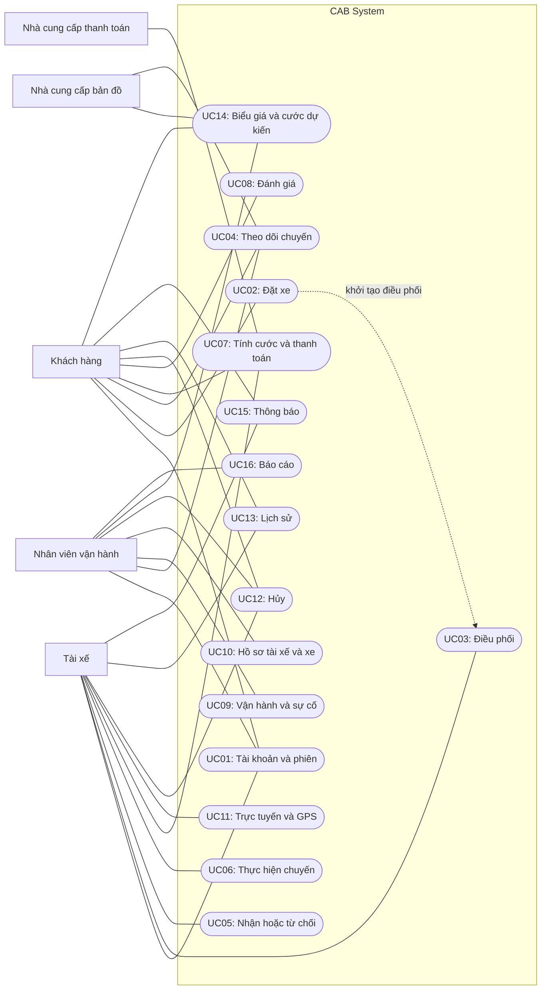

# Software Requirements Specification — CAB System

- Phiên bản tài liệu: 1.1 — Bản đề xuất thống nhất
- Phạm vi: MVP hệ thống đặt xe trực tuyến
- Chủ dự án: Nguyễn Đại Long
- Trạng thái: Chờ duyệt nội dung trước khi đồng bộ API, test case và thiết kế microservices

Tài liệu này xác định yêu cầu nghiệp vụ và hành vi cần đạt của CAB System. Công nghệ triển khai, cấu trúc mã nguồn, cấu trúc cơ sở dữ liệu vật lý và giao tiếp chi tiết giữa các dịch vụ được mô tả trong tài liệu thiết kế riêng.

## Quy ước tài liệu

| Tiền tố | Ý nghĩa |
|---|---|
| BG | Mục tiêu nghiệp vụ |
| BR | Yêu cầu nghiệp vụ |
| BP | Quy trình nghiệp vụ |
| FR | Yêu cầu chức năng |
| BRu | Quy tắc nghiệp vụ |
| NFR | Yêu cầu phi chức năng |
| UC | Use Case |
| AC | Tiêu chí chấp nhận |
| RQM | Ma trận truy xuất yêu cầu |

Quy ước:

- Các mã đã được sử dụng không được đổi ý nghĩa tùy theo từng mục.
- Trạng thái kỹ thuật được viết bằng chữ hoa và dùng thống nhất trong SRS, API, mô hình dữ liệu và test case.
- “Yêu cầu đặt xe”, “lời mời nhận chuyến” và “chuyến đi” là ba đối tượng khác nhau.
- Tài liệu đặc tả yêu cầu không được xem là bằng chứng chức năng đã được triển khai hoặc kiểm thử thành công.

---

# B1. Ngữ cảnh và vấn đề nghiệp vụ

## 1.1. Ngữ cảnh

Công ty ABC cung cấp dịch vụ vận chuyển hành khách và cần xây dựng CAB System để số hóa hoạt động đặt xe.

Hệ thống hỗ trợ khách hàng đặt xe, tự động tìm tài xế phù hợp, theo dõi chuyến, tính cước, thanh toán và đánh giá. Nhân viên vận hành sử dụng hệ thống để quản lý tài khoản, tài xế, phương tiện và xử lý sự cố.

## 1.2. Vấn đề cần giải quyết

| Vấn đề | Ảnh hưởng |
|---|---|
| Phân công tài xế thủ công | Khách chờ lâu, khó đáp ứng khi số yêu cầu tăng |
| Thông tin chuyến và vị trí không được cập nhật tập trung | Khách hàng và nhân viên khó biết chuyến đang ở đâu |
| Quản lý thanh toán rời rạc | Khó phân biệt chưa thanh toán, đã thanh toán và giao dịch chưa xác định |
| Thiếu quy trình xử lý ngoại lệ thống nhất | Chuyến có thể bị treo khi tài xế từ chối, mất kết nối hoặc gặp sự cố |
| Thiếu kiểm soát truy cập và lưu vết | Khó bảo vệ dữ liệu và xác định người thực hiện thay đổi |
| Hệ thống khó mở rộng | Việc bổ sung chức năng có thể ảnh hưởng nhiều thành phần |

## 1.3. Luồng nghiệp vụ tổng quát

Đăng nhập → tạo yêu cầu đặt xe → tìm tài xế → tài xế nhận chuyến → đến điểm đón → đón khách → thực hiện chuyến → hoàn thành → tính cước → thanh toán.

Sau khi chuyến hoàn thành, khách hàng có thể đánh giá và xem lịch sử.

Thông báo và giám sát vận hành diễn ra xuyên suốt quá trình.

---

# B2. Các bên liên quan và vai trò

## 2.1. Stakeholder

| Stakeholder | Vai trò và nhu cầu |
|---|---|
| Khách hàng | Đặt xe, theo dõi chuyến, thanh toán, xem lịch sử và đánh giá |
| Tài xế | Nhận hoặc từ chối lời mời, cập nhật vị trí, thực hiện chuyến và xác nhận thu tiền mặt |
| Nhân viên vận hành | Quản lý khách hàng, tài xế, phương tiện, biểu giá; giám sát chuyến và xử lý sự cố |
| Ban lãnh đạo | Theo dõi kết quả vận hành, số chuyến và số tiền đã thu |
| Nhà cung cấp thanh toán | Tiếp nhận giao dịch điện tử, trả kết quả và hỗ trợ tra cứu giao dịch |
| Nhà cung cấp bản đồ/định tuyến | Hỗ trợ tìm địa chỉ, xác định tuyến đường, khoảng cách và thời gian dự kiến khi tích hợp |

Ban lãnh đạo là bên liên quan, không mặc nhiên có tài khoản hoặc vai trò riêng trong MVP. Báo cáo có thể được nhân viên vận hành cung cấp.

## 2.2. Ma trận ảnh hưởng và quan tâm

| Stakeholder | Mức ảnh hưởng | Mức quan tâm | Cách phối hợp |
|---|---|---|---|
| Ban lãnh đạo | Cao | Cao | Xác nhận phạm vi và tiêu chí thành công |
| Nhân viên vận hành | Cao | Cao | Xác nhận quy trình quản lý và xử lý ngoại lệ |
| Khách hàng | Trung bình | Cao | Đánh giá trải nghiệm đặt xe và theo dõi |
| Tài xế | Trung bình | Cao | Đánh giá nhận chuyến, vị trí và thao tác thực hiện chuyến |
| Nhà cung cấp thanh toán | Cao trong phạm vi thanh toán | Trung bình | Thống nhất hợp đồng tích hợp và đối soát |
| Nhà cung cấp bản đồ | Trung bình | Trung bình | Thống nhất dữ liệu và giới hạn dịch vụ |

## 2.3. Vai trò tài khoản trong MVP

| Vai trò | Quyền chính |
|---|---|
| CUSTOMER | Sử dụng các chức năng dành cho khách hàng trên dữ liệu của mình |
| DRIVER | Sử dụng các chức năng tài xế trên hồ sơ và chuyến được phân công |
| OPERATOR | Thực hiện chức năng vận hành được quy định trong MVP |

Mỗi tài khoản có một vai trò trong MVP.

Người dùng không được tự thay đổi vai trò. Vai trò OPERATOR không mặc nhiên được sửa mật khẩu người khác, sửa giao dịch đã thành công hoặc xóa nhật ký.

---

# B3. Mục tiêu nghiệp vụ

| Mã | Mục tiêu |
|---|---|
| BG01 | Số hóa quá trình tạo và quản lý yêu cầu đặt xe |
| BG02 | Tự động tìm và phân công tài xế phù hợp |
| BG03 | Cung cấp trạng thái và vị trí chuyến cho người được phép theo dõi |
| BG04 | Quản lý vòng đời chuyến và xử lý các trường hợp bất thường |
| BG05 | Tính cước và ghi nhận thanh toán chính xác, tránh thu tiền trùng |
| BG06 | Thông báo kịp thời các sự kiện quan trọng |
| BG07 | Hỗ trợ quản lý tài xế, phương tiện, biểu giá và hoạt động vận hành |
| BG08 | Bảo vệ tài khoản, dữ liệu và kiểm soát quyền truy cập |
| BG09 | Thu thập đánh giá để theo dõi chất lượng dịch vụ |

---

# B4. Phạm vi, giả định và ưu tiên

## 4.1. Trong phạm vi MVP bắt buộc

- Khách hàng tự đăng ký tài khoản.
- Khách hàng, tài xế và nhân viên vận hành đăng nhập.
- Xem hồ sơ, cập nhật thông tin được phép, đổi mật khẩu, làm mới phiên và đăng xuất.
- Nhân viên vận hành cấp tài khoản tài xế, quản lý hồ sơ và phương tiện.
- Tài xế chuyển trực tuyến/ngoại tuyến và cung cấp vị trí.
- Khách hàng tạo yêu cầu đặt xe tức thời.
- Tìm tài xế, gửi lời mời, nhận/từ chối và xử lý hết hạn.
- Theo dõi và cập nhật trạng thái chuyến.
- Hủy trước khi đón khách theo quy tắc.
- Ghi nhận sự cố và hỗ trợ xử lý.
- Quản lý biểu giá, tính cước sau chuyến.
- Thanh toán tiền mặt và tích hợp một nhà cung cấp thanh toán điện tử.
- Thông báo trong ứng dụng.
- Xem lịch sử chuyến và trạng thái thanh toán.
- Kiểm soát truy cập và ghi nhật ký thao tác quan trọng.

Trong môi trường học tập, tích hợp thanh toán điện tử sử dụng sandbox của nhà cung cấp. Không coi phản hồi giả lập nội bộ là bằng chứng tích hợp thành công với nhà cung cấp.

## 4.2. Chức năng ưu tiên sau luồng cốt lõi

- Đánh giá tài xế sau chuyến.
- Tìm địa chỉ bằng dịch vụ bản đồ.
- Ước tính giá trước khi đặt xe.
- Báo cáo cơ bản về số chuyến, tỷ lệ hủy và số tiền đã thu.

Các chức năng này được đặc tả để giữ thiết kế thống nhất, nhưng có thể triển khai sau luồng đặt xe đến thanh toán.

## 4.3. Ngoài phạm vi MVP

- Tài xế tự đăng ký và tự tải hồ sơ xét duyệt.
- Một tài khoản sử dụng đồng thời nhiều vai trò.
- Đặt xe theo lịch, ghép chuyến, nhiều điểm dừng.
- Khuyến mãi, ví nội bộ, định giá theo nhu cầu.
- Tính phí hủy và hoàn tiền tự động.
- Tự động tính cước cho chuyến kết thúc bất thường giữa hành trình.
- Quản lý lương và chia doanh thu cho tài xế.
- Báo cáo phân tích nâng cao.
- Khôi phục mật khẩu tự phục vụ qua email/SMS.
- Gửi SMS, email và push qua nhiều nhà cung cấp.
- Tự động phân công lại tài xế cho một Trip đã được tạo.

## 4.4. Giả định vận hành

- Nhân viên vận hành kiểm tra hồ sơ tài xế và phương tiện trước khi cho phép nhận chuyến.
- Tài khoản OPERATOR được cấp bằng quy trình quản trị riêng; không có đăng ký OPERATOR công khai.
- Một tài xế chỉ sử dụng một phương tiện đang được chọn tại một thời điểm.
- Một phương tiện không phục vụ đồng thời nhiều tài xế.
- Mỗi khách hàng chỉ có tối đa một yêu cầu/chuyến đang hoạt động.
- Các ngưỡng ở mục 4.5 là đề xuất cho MVP, cần được duyệt trước khi dùng làm chuẩn nghiệm thu.
- Không thể suy ra khả năng vận hành thực tế chỉ từ các ngưỡng được ghi trong tài liệu.

## 4.5. Thông số đề xuất cho MVP

| Thông số | Giá trị đề xuất | Ý nghĩa |
|---|---:|---|
| Bán kính tìm tài xế | 5 km | Khoảng cách từ vị trí tài xế đến điểm đón để chọn ứng viên |
| Thời hạn một lời mời | 30 giây | Tính từ khi hệ thống phát hành lời mời |
| Số lời mời tối đa cho một Booking | 5 | Bao gồm lời mời đầu tiên |
| Thời gian tìm tài xế tối đa | 180 giây | Tính từ khi Booking bắt đầu FINDING_DRIVER |
| Chu kỳ gửi vị trí | 5 giây | Khi tài xế trực tuyến và thiết bị có kết nối |
| Ngưỡng vị trí cũ | 30 giây | Không dùng vị trí cũ hơn ngưỡng để ghép chuyến mới |
| Thời gian chờ khách trước khi báo vắng mặt | 5 phút | Tính từ thời điểm ARRIVED_PICKUP |
| Thời hạn access token | 15 phút | Không thay thế yêu cầu kiểm tra phiên bị thu hồi |
| Thời hạn phiên/refresh token | 7 ngày | Tính từ lần đăng nhập; làm mới token không kéo dài vô hạn phiên |

Các cấu hình điều phối được ghi nhận theo từng tiến trình. Thay đổi cấu hình chỉ áp dụng cho tiến trình mới.

---

# B5. Yêu cầu nghiệp vụ

| Mã | Yêu cầu |
|---|---|
| BR01 | Khách hàng có thể tạo và theo dõi yêu cầu đặt xe trực tuyến |
| BR02 | Hệ thống tự động tìm, mời và phân công tài xế phù hợp |
| BR03 | Người được phép có thể theo dõi trạng thái, tài xế, vị trí và ETA của chuyến |
| BR04 | Hệ thống quản lý thực hiện chuyến, hủy hợp lệ, lịch sử và sự cố |
| BR05 | Hệ thống xác định cước và ghi nhận thanh toán bằng tiền mặt hoặc điện tử |
| BR06 | Nhân viên vận hành quản lý và giám sát hoạt động của CAB |
| BR07 | Khách hàng có thể đánh giá tài xế sau khi hoàn thành chuyến |
| BR08 | Hệ thống quản lý tài khoản, phiên đăng nhập và quyền truy cập |
| BR09 | Hệ thống quản lý hồ sơ tài xế, phương tiện và điều kiện sẵn sàng nhận chuyến |
| BR10 | Hệ thống gửi và quản lý thông báo cho các bên liên quan |
| BR11 | Hệ thống quản lý biểu giá và cung cấp thông tin cước minh bạch |

BR06 luôn là quản lý và giám sát vận hành. BR07 luôn là đánh giá tài xế.

---

# B6. Quy trình nghiệp vụ

| Mã | Quy trình | Các bước chính |
|---|---|---|
| BP01 | Đặt xe | Đăng nhập → nhập điểm đón/đến → chọn dịch vụ → kiểm tra hợp lệ → tạo Booking |
| BP02 | Tìm và phân công tài xế | Chọn ứng viên → tạo TripRequest → chờ phản hồi → nhận thành công hoặc thử ứng viên khác |
| BP03 | Thực hiện chuyến | Phân công → đến đón → đón khách → di chuyển → hoàn thành |
| BP04 | Tính cước và thanh toán | Chốt dữ liệu chuyến → tính cước → chọn phương thức → xử lý → ghi nhận kết quả |
| BP05 | Giám sát và xử lý sự cố | Phát hiện/tiếp nhận → ghi nhận → kiểm tra → xử lý theo quyền → lưu vết |
| BP06 | Đánh giá | Chọn chuyến hoàn thành → nhập điểm/nhận xét → kiểm tra quyền → lưu đánh giá |
| BP07 | Quản lý tài khoản | Đăng ký/cấp tài khoản → đăng nhập → quản lý hồ sơ và phiên → đăng xuất |
| BP08 | Quản lý tài xế và xe | Cấp tài khoản → nhập hồ sơ → xác nhận hợp lệ → gán xe → trực tuyến và cập nhật GPS |
| BP09 | Hủy yêu cầu/chuyến | Yêu cầu hủy → kiểm tra trạng thái → hủy hợp lệ → kết thúc lời mời → giải phóng tài xế nếu có |
| BP10 | Thông báo | Nhận sự kiện → xác định người nhận → tạo thông báo → gửi → ghi nhận trạng thái |
| BP11 | Quản lý biểu giá | Tạo phiên bản → kiểm tra → đặt thời điểm hiệu lực → áp dụng cho Booking mới |
| BP12 | Tra cứu lịch sử | Xác thực → xác định phạm vi dữ liệu → lọc/phân trang → xem chi tiết |
| BP13 | Báo cáo cơ bản | Chọn khoảng thời gian → tổng hợp dữ liệu hợp lệ → hiển thị chỉ tiêu và cách tính |

---

# B7. Yêu cầu chức năng

## FR01 – Quản lý tài khoản và xác thực

- FR01.1: Khách hàng tự đăng ký bằng họ tên, email, số điện thoại và mật khẩu.
- FR01.2: Ba vai trò đăng nhập bằng email hoặc số điện thoại và mật khẩu.
- FR01.3: Người dùng xem và cập nhật các trường hồ sơ được phép.
- FR01.4: Người dùng đổi mật khẩu sau khi xác minh mật khẩu hiện tại.
- FR01.5: Người dùng làm mới phiên bằng refresh token hợp lệ.
- FR01.6: Người dùng đăng xuất và thu hồi phiên hiện tại.
- FR01.7: Hệ thống kiểm tra trạng thái tài khoản, vai trò và quyền đối với tài nguyên.

## FR02 – Tạo yêu cầu đặt xe

Khách hàng nhập điểm đón, điểm đến và loại dịch vụ. Hệ thống kiểm tra dữ liệu và điều kiện tạo Booking.

## FR03 – Tiếp nhận và quản lý yêu cầu đặt xe

Hệ thống cấp bookingId, ghi nhận yêu cầu, chuyển sang tìm tài xế và cung cấp trạng thái hiện tại.

Yêu cầu gửi lại do lỗi mạng không được tạo Booking trùng khi cùng mã chống lặp.

## FR04 – Tìm tài xế phù hợp

Hệ thống tìm tài xế theo vị trí mới nhất, trạng thái sẵn sàng, hồ sơ hợp lệ, phương tiện và loại dịch vụ.

## FR05 – Gửi và phản hồi lời mời

Hệ thống gửi TripRequest cho tài xế. Tài xế được chỉ định có thể nhận hoặc từ chối khi lời mời còn hiệu lực.

## FR06 – Tìm tài xế thay thế

Hệ thống thử ứng viên khác khi lời mời bị từ chối, hết hạn hoặc tài xế không còn đủ điều kiện.

## FR07 – Thông báo kết quả điều phối

Khách hàng nhận được kết quả tìm tài xế thành công hoặc không tìm được tài xế. Khi thành công, kết quả liên kết tới Trip được tạo.

## FR08 – Cập nhật trạng thái chuyến

Tài xế được phân công cập nhật chuyến đúng trình tự. Hệ thống lưu người thực hiện và thời điểm của mỗi thay đổi.

## FR09 – Theo dõi chuyến

Khách hàng và vận hành xem trạng thái, tài xế, xe, vị trí gần nhất và ETA khi có dữ liệu hợp lệ.

Vị trí cũ hoặc ETA không tính được phải được thể hiện rõ, không giả định bằng 0.

## FR10 – Tính cước thực tế

Sau khi Trip hoàn thành, hệ thống tính cước từ quãng đường, thời gian thực tế và phiên bản biểu giá gắn với Booking.

## FR11 – Thanh toán

Khách hàng chọn tiền mặt hoặc phương thức điện tử được hỗ trợ.

Chọn tiền mặt chỉ tạo yêu cầu thanh toán; tài xế phải xác nhận đã thu đủ tiền.

## FR12 – Xử lý kết quả thanh toán

Hệ thống xác minh kết quả thanh toán điện tử, xử lý thông báo trùng, theo dõi từng lần thử và đối soát trường hợp chưa rõ kết quả.

## FR13 – Thông báo

Hệ thống tạo thông báo trong ứng dụng cho các sự kiện quan trọng, cho phép xem danh sách và đánh dấu đã đọc.

## FR14 – Quản lý dữ liệu vận hành

Nhân viên vận hành xem dữ liệu khách hàng, tài xế, xe, chuyến và thanh toán; cập nhật dữ liệu thuộc quyền được quy định.

Thay đổi trạng thái tài khoản được xử lý bởi thành phần sở hữu tài khoản.

## FR15 – Giám sát và xử lý sự cố

Nhân viên vận hành xem chuyến đang hoạt động, ghi nhận sự cố, theo dõi tiến trình xử lý và tra cứu nhật ký.

## FR16 – Đánh giá tài xế

Khách hàng của chuyến hoàn thành được gửi một đánh giá gồm điểm nguyên từ 1 đến 5 và nhận xét tùy chọn.

## FR17 – Quản lý hồ sơ tài xế và phương tiện

Nhân viên vận hành cấp tài khoản tài xế, quản lý hồ sơ, xác nhận điều kiện hoạt động, gán phương tiện và ngừng cho phép nhận chuyến mới khi cần.

## FR18 – Trạng thái hoạt động và vị trí tài xế

Tài xế yêu cầu trực tuyến/ngoại tuyến và gửi vị trí. Hệ thống tự quản lý trạng thái BUSY theo phân công chuyến.

## FR19 – Hủy Booking hoặc Trip

Khách hàng, tài xế hoặc vận hành thực hiện hủy theo điều kiện của từng đối tượng và trạng thái. Mọi lần hủy phải có lý do.

## FR20 – Lịch sử chuyến

Khách hàng và tài xế xem danh sách, chi tiết các chuyến thuộc phạm vi của mình, gồm kết quả chuyến và thanh toán.

## FR21 – Biểu giá và cước dự kiến

- FR21.1: Nhân viên vận hành quản lý phiên bản biểu giá theo loại dịch vụ.
- FR21.2: Khách hàng có thể tìm địa chỉ và xem cước dự kiến khi chức năng bản đồ/ước tính được triển khai.
- Cước dự kiến phải được phân biệt với cước thực tế.

## FR22 – Báo cáo cơ bản

Nhân viên vận hành xem số chuyến, số chuyến hoàn thành/hủy và số tiền đã thu trong khoảng thời gian được chọn.

---

# B8. Quy tắc nghiệp vụ và ngoại lệ

## 8.1. Các quy tắc nghiệp vụ

| Mã | Quy tắc |
|---|---|
| BRu01 | Chỉ chọn tài xế có Account ACTIVE, hồ sơ được phép hoạt động, xe hợp lệ đúng loại dịch vụ, trạng thái AVAILABLE và vị trí còn mới trong bán kính cấu hình |
| BRu02 | Một tài xế chỉ có tối đa một Trip đang hoạt động. Không được tự chuyển BUSY thành AVAILABLE để nhận thêm chuyến |
| BRu03 | Mỗi Booking có tối đa một lời mời PENDING. Thử lại theo giới hạn tại mục 4.5; dừng khi hết ứng viên, hết số lời mời hoặc hết tổng thời gian |
| BRu04 | Mỗi Booking có tối đa một Trip. Chỉ tạo Trip sau khi chấp nhận lời mời hợp lệ và giành được quyền phân công |
| BRu05 | Trip chỉ chuyển theo bảng trạng thái tại mục 8.2; mọi lần chuyển được lưu lịch sử |
| BRu06 | Cước thực tế chỉ được chốt khi Trip COMPLETED và có đủ dữ liệu hợp lệ |
| BRu07 | Không lưu số thẻ đầy đủ, mã bảo mật thẻ hoặc thông tin đăng nhập tài khoản thanh toán của khách |
| BRu08 | Thanh toán điện tử đi qua nhà cung cấp; không xác nhận thành công chỉ dựa vào trang chuyển hướng phía khách |
| BRu09 | Kiểm tra vai trò và quyền trên dữ liệu; biết ID không đồng nghĩa có quyền truy cập |
| BRu10 | Ghi nhật ký thay đổi tài khoản, hồ sơ tài xế, xe, biểu giá, trạng thái chuyến, xử lý sự cố và kết quả thanh toán |
| BRu11 | Đăng ký công khai chỉ tạo CUSTOMER; từ chối trường role/accountStatus do người đăng ký tự gán |
| BRu12 | Email và điện thoại được chuẩn hóa và duy nhất trên toàn bộ Account; đăng nhập dùng emailOrPhone, không có username riêng |
| BRu13 | Chỉ Account ACTIVE được dùng chức năng yêu cầu xác thực. Khóa tài khoản thu hồi mọi phiên; nếu tài xế đang có chuyến, tạo cảnh báo vận hành |
| BRu14 | Người dùng không tự sửa role, accountStatus hoặc ID. Thay đổi email/điện thoại phải xác minh mật khẩu hiện tại và kiểm tra trùng |
| BRu15 | Đăng xuất thu hồi phiên hiện tại; đổi mật khẩu thu hồi mọi phiên. Refresh token được thay thế sau mỗi lần làm mới và token cũ không được sử dụng lại |
| BRu16 | Hủy theo mục 8.3; không tính phí hủy tự động trong MVP |
| BRu17 | Một Trip có tối đa một Fare đã chốt và một Payment thành công; nhiều lần thử phải được ghi nhận riêng |
| BRu18 | Một Trip COMPLETED có tối đa một Rating của đúng khách hàng. Việc đánh giá không phụ thuộc trạng thái thanh toán |
| BRu19 | Vị trí có thời điểm ghi nhận; dữ liệu quá cũ không dùng để ghép mới. Vị trí gửi bù cũ hơn không được ghi đè vị trí mới |
| BRu20 | Account, Driver, Booking, TripRequest, Trip và Payment có các bộ trạng thái riêng; không dùng thay thế cho nhau |
| BRu21 | Cùng một sự kiện không tạo thông báo trùng cho cùng người nhận và cùng kênh; thông báo thất bại không đảo ngược nghiệp vụ đã thành công |
| BRu22 | Khách hàng có tối đa một Booking đang tìm hoặc một Trip đang hoạt động. Payment chưa hoàn tất của chuyến cũ không bị nhầm với trạng thái chuyến đang hoạt động |

### Quy tắc chọn ứng viên

- Xếp ứng viên hợp lệ theo khoảng cách tăng dần tới điểm đón.
- Khi bằng khoảng cách, dùng driverId làm thứ tự phụ ổn định.
- Không gửi lại cùng một tài xế trong cùng tiến trình điều phối.
- Kiểm tra lại điều kiện khi tài xế nhận; dữ liệu ứng viên ban đầu không đủ để bảo đảm phân công.
- Nếu hai yêu cầu đồng thời tranh chấp cùng tài xế, chỉ một yêu cầu được phân công; yêu cầu còn lại tiếp tục tìm.
- Việc hủy Booking và nhận chuyến đồng thời phải có một kết quả thống nhất, không vừa hủy thành công vừa tạo chuyến hợp lệ.

### Quy tắc loại dịch vụ và biểu giá

Các mã loại dịch vụ trong MVP:

- STANDARD
- PREMIUM
- MOTORBIKE
- VAN

Mỗi phương tiện được gán loại dịch vụ đáp ứng trong phạm vi MVP. Không suy ra loại dịch vụ chỉ từ tên hoặc nhãn xe.

Công thức cước:

`totalAmount = baseFare + distanceKm × pricePerKm + durationMinutes × pricePerMinute`

- Đơn vị tiền tệ: VND.
- Giá và các thành phần cước không âm.
- Làm tròn tổng cuối cùng tới đồng gần nhất; không làm tròn riêng từng thành phần.
- Quãng đường tính theo tuyến thực tế được hệ thống xác nhận, không dùng khoảng cách đường thẳng giữa hai điểm làm cước thực tế.
- Thời gian tính cước từ lúc IN_PROGRESS đến COMPLETED.
- Booking lưu phiên bản biểu giá và các đơn giá áp dụng tại thời điểm tạo.
- Biểu giá mới không làm thay đổi cước của Booking đã tồn tại.
- Mỗi loại dịch vụ chỉ có một phiên bản biểu giá có hiệu lực tại một thời điểm.
- Nếu thiếu dữ liệu tính cước, chưa chốt Fare và chưa thu tiền; tạo yêu cầu kiểm tra cho vận hành.
- Nguồn dữ liệu quãng đường và cách xác nhận phải được cụ thể hóa trong thiết kế trước khi triển khai.

### Quy tắc thanh toán

- CASH: tạo Payment PENDING; chỉ tài xế của chuyến xác nhận đã nhận đủ tiền.
- Thanh toán điện tử: một nhà cung cấp được tích hợp; chỉ hiển thị các phương thức mà nhà cung cấp đó hỗ trợ.
- Kết quả phải được xác minh nguồn gửi, giao dịch, số tiền và đơn vị tiền.
- Thông báo trùng hoặc gửi lại không được ghi nhận thu tiền thêm lần nữa.
- Timeout là kết quả chưa xác định, không tự coi là FAILED.
- Khi kết quả UNKNOWN, phải đối soát trước khi thử lại hoặc chuyển sang tiền mặt.
- Chỉ thử lại khi lần trước đã xác định thất bại.
- Không có hai PaymentAttempt đang xử lý đồng thời cho cùng Payment.
- Payment SUCCESS không bị hạ xuống FAILED bởi một thông báo đến muộn.
- Thông tin thu tiền mặt gồm người xác nhận, thời điểm và số tiền.
- Các trường hợp tranh chấp kết quả được ghi nhận thành sự cố để xử lý, không sửa trực tiếp lịch sử.

## 8.2. Trạng thái chuẩn

### Account

| Trạng thái | Ý nghĩa |
|---|---|
| ACTIVE | Được sử dụng hệ thống theo quyền |
| INACTIVE | Chưa hoạt động hoặc đã ngừng hoạt động |
| SUSPENDED | Bị đình chỉ |

Trạng thái tài khoản không đồng nghĩa trạng thái trực tuyến của tài xế.

### Driver

| Chuyển trạng thái | Điều kiện |
|---|---|
| OFFLINE → AVAILABLE | Account ACTIVE, hồ sơ/xe hợp lệ và có vị trí mới |
| AVAILABLE → OFFLINE | Tài xế yêu cầu ngoại tuyến hoặc không còn đáp ứng điều kiện |
| AVAILABLE → BUSY | Hệ thống xác nhận phân công thành công |
| BUSY → AVAILABLE | Trip kết thúc và tài xế vẫn đáp ứng điều kiện nhận chuyến |
| BUSY → OFFLINE | Trip kết thúc nhưng tài xế/xe không còn đáp ứng điều kiện |

Nếu tài xế BUSY mất mạng, không tự giải phóng tài xế để nhận chuyến khác. Hệ thống đánh dấu mất kết nối và báo vận hành.

### Booking

| Trạng thái | Ý nghĩa |
|---|---|
| PENDING | Đã tiếp nhận |
| FINDING_DRIVER | Đang tìm tài xế |
| DRIVER_ASSIGNED | Đã phân công và liên kết Trip |
| NO_DRIVER_FOUND | Kết thúc tìm nhưng không phân công được |
| CANCELLED | Hủy trước khi phân công |

Luồng chính:

`PENDING → FINDING_DRIVER → DRIVER_ASSIGNED`

Luồng khác:

- PENDING → CANCELLED.
- FINDING_DRIVER → CANCELLED.
- FINDING_DRIVER → NO_DRIVER_FOUND.

DRIVER_ASSIGNED là kết quả điều phối. Nếu Trip bị hủy sau đó, Booking vẫn giữ kết quả này; trạng thái hủy thuộc Trip.

### TripRequest

`PENDING → ACCEPTED | REJECTED | EXPIRED | CANCELLED`

- EXPIRED: hết hạn phản hồi.
- CANCELLED: Booking đã hủy hoặc lời mời bị hệ thống thu hồi.
- Tài xế không được nhận lại lời mời đã hết hiệu lực.

### Trip

Luồng chính:

`DRIVER_ASSIGNED → ARRIVED_PICKUP → PICKED_UP → IN_PROGRESS → COMPLETED`

- DRIVER_ASSIGNED: có tài xế, đang tiến tới điểm đón.
- ARRIVED_PICKUP: đã đến điểm đón.
- PICKED_UP: đã đón khách.
- IN_PROGRESS: bắt đầu hành trình tính cước.
- COMPLETED: hành trình kết thúc bình thường.
- CANCELLED: bị hủy hợp lệ trước khi đón khách.
- ERROR: hành trình bị gián đoạn và cần xử lý sự cố.

Quy định:

- Chỉ DRIVER_ASSIGNED và ARRIVED_PICKUP được chuyển sang CANCELLED.
- Các trạng thái chưa kết thúc có thể chuyển sang ERROR khi xảy ra sự cố.
- Lưu trạng thái ngay trước ERROR.
- OPERATOR có thể khôi phục về trạng thái trước ERROR sau khi xác minh điều kiện tiếp tục, có lý do và nhật ký.
- Nếu chuyến không thể tiếp tục, ERROR được đóng bằng kết quả xử lý sự cố; không tự đổi thành COMPLETED.
- COMPLETED và CANCELLED không được chuyển trở lại trạng thái đang thực hiện.
- Trip ERROR chưa giải quyết vẫn giữ tài xế BUSY; chỉ giải phóng khi vận hành xác nhận kết thúc hoặc xử lý phù hợp.
- Việc kết thúc Trip và thanh toán là hai quá trình riêng. Trip COMPLETED không đồng nghĩa Payment SUCCESS.

### Payment và PaymentAttempt

| Trạng thái | Ý nghĩa |
|---|---|
| PENDING | Chờ bắt đầu xử lý hoặc chờ xác nhận thu tiền mặt |
| PROCESSING | Đang xử lý thanh toán điện tử |
| SUCCESS | Đã xác nhận thanh toán thành công |
| FAILED | Đã xác định lần xử lý thất bại |
| UNKNOWN | Chưa xác định được kết quả, cần đối soát |

Luồng được phép:

- CASH: PENDING → SUCCESS khi tài xế xác nhận.
- Điện tử: PENDING → PROCESSING → SUCCESS, FAILED hoặc UNKNOWN.
- UNKNOWN → SUCCESS hoặc FAILED sau đối soát.
- Payment FAILED có thể mở lần thử mới; lịch sử PaymentAttempt cũ được giữ nguyên.
- SUCCESS là kết quả cuối cùng trong phạm vi MVP.

## 8.3. Hủy và giải phóng tài xế

| Trường hợp | Người được thực hiện | Xử lý |
|---|---|---|
| Booking chưa phân công | Khách sở hữu hoặc OPERATOR | Hủy Booking, thu hồi lời mời và dừng tìm |
| Trip trước PICKED_UP | Khách của chuyến, tài xế được phân công hoặc OPERATOR | Hủy Trip với lý do và thông báo cho bên còn lại |
| Khách không xuất hiện | Tài xế của chuyến | Chỉ chấp nhận lý do NO_SHOW sau thời gian chờ quy định |
| Tài xế/xe gặp sự cố trước đón | Tài xế hoặc OPERATOR | Hủy Trip; đưa tài xế OFFLINE nếu không đủ điều kiện |
| Sau PICKED_UP | Tài xế hoặc OPERATOR báo sự cố | Chuyển xử lý sự cố, không dùng thao tác hủy thông thường |

Khi khách muốn đặt lại sau hủy, tạo Booking mới. MVP không tự thay tài xế trong Trip cũ.

## 8.4. Ngoại lệ bắt buộc

| Ngoại lệ | Hành vi yêu cầu |
|---|---|
| Thiếu dữ liệu hoặc dữ liệu sai | Từ chối, chỉ ra trường lỗi, không tạo dữ liệu nghiệp vụ dở dang |
| Không có tài xế phù hợp | Kết thúc NO_DRIVER_FOUND và thông báo khách |
| Tài xế từ chối/hết hạn | Thu hồi hiệu lực lời mời cũ và thử ứng viên khác trong giới hạn |
| Nhận chuyến khi lời mời hết hạn hoặc Booking đã hủy | Từ chối; không tạo Trip |
| Mất GPS | Hiển thị thời điểm vị trí gần nhất và trạng thái dữ liệu cũ |
| Hệ thống lỗi sau khi nhận lệnh thành công | Cho phép tra cứu/gửi lại an toàn, không tạo trùng kết quả |
| Thanh toán timeout | Đánh dấu UNKNOWN và đối soát |
| Webhook trùng/sai nguồn/sai số tiền | Không ghi nhận thu tiền trùng hoặc thành công không hợp lệ |
| Gửi thông báo thất bại | Ghi nhận lỗi và thử lại; giữ kết quả nghiệp vụ gốc |
| Account tài xế bị khóa giữa chuyến | Thu hồi quyền, giữ thông tin chuyến và chuyển vận hành xử lý; không tự ghi hoàn thành/hủy |

---

# B9. Mô hình dữ liệu nghiệp vụ

Đây là mô hình khái niệm. Việc chia bảng, collection, cache và khóa ngoại vật lý được quyết định ở tài liệu thiết kế.

## 9.1. Các thực thể

| Thực thể | Thuộc tính chính | Vai trò |
|---|---|---|
| Account | accountId, fullName, email, phone, passwordHash, role, accountStatus, createdAt, updatedAt | Tài khoản và thông tin chung |
| Session | sessionId, accountId, refreshTokenHash, expiresAt, revokedAt | Phiên đăng nhập |
| Customer | customerId, accountId | Định danh nghiệp vụ khách hàng |
| Driver | driverId, accountId, licenseNumber, approvalStatus, driverStatus, activeVehicleId | Hồ sơ và điều kiện hoạt động tài xế |
| Operator | operatorId, accountId | Định danh nhân viên vận hành |
| Vehicle | vehicleId, licensePlate, vehicleType, vehicleStatus, driverId | Phương tiện phục vụ |
| DriverLocation | driverId, latitude, longitude, recordedAt, receivedAt | Vị trí gần nhất và độ mới dữ liệu |
| BookingRequest | bookingId, customerId, pickup, destination, vehicleType, bookingStatus, pricingVersionId, pricingSnapshot, createdAt | Ý định đặt xe |
| DispatchProcess | bookingId, dispatchStatus, attemptCount, startedAt, deadlineAt, configSnapshot | Quá trình tìm tài xế |
| TripRequest | tripRequestId, bookingId, driverId, status, sentAt, expiresAt, respondedAt, reason | Lời mời cho một tài xế |
| Trip | tripId, bookingId, customerId, driverId, vehicleId, tripStatus, startedAt, completedAt, closedAt, closeReason | Chuyến thực tế |
| TripStatusHistory | tripId, previousStatus, newStatus, changedBy, changedAt, reason | Lịch sử chuyển trạng thái |
| PricingConfig | pricingVersionId, vehicleType, baseFare, pricePerKm, pricePerMinute, effectiveFrom, effectiveTo | Phiên bản biểu giá |
| Fare | fareId, tripId, pricingVersionId, distanceKm, durationMinutes, baseAmount, distanceAmount, timeAmount, totalAmount, currency | Cước đã tính của chuyến |
| Payment | paymentId, fareId, customerId, method, paymentStatus, amount, paidAt, confirmedBy | Nghĩa vụ và kết quả thanh toán |
| PaymentAttempt | attemptId, paymentId, idempotencyKey, providerTransactionId, status, createdAt, resolvedAt | Từng lần xử lý thanh toán |
| Rating | ratingId, tripId, customerId, driverId, score, comment, createdAt | Đánh giá sau chuyến |
| Notification | notificationId, eventId, recipientAccountId, eventType, referenceId, deliveryStatus, isRead, createdAt | Thông báo tới tài khoản |
| IncidentRecord | incidentId, tripId, issueType, description, status, reportedBy, handledBy, resolution, createdAt, resolvedAt | Xử lý sự cố |
| AuditLog | auditId, actorId, action, entityType, entityId, changedFields, occurredAt, correlationId | Truy vết thao tác |

Các trường mật khẩu/token và dữ liệu thanh toán nhạy cảm không được đưa vào changedFields.

## 9.2. Quan hệ và ràng buộc

- Account có nhiều Session.
- Account liên kết một hồ sơ phù hợp với vai trò trong MVP.
- Customer có nhiều BookingRequest theo thời gian.
- BookingRequest có một DispatchProcess và nhiều TripRequest.
- BookingRequest có tối đa một Trip.
- Driver có nhiều Trip theo lịch sử nhưng tối đa một Trip đang hoạt động.
- Trip có nhiều TripStatusHistory.
- Trip có tối đa một Fare đã chốt.
- Fare có tối đa một Payment.
- Payment có nhiều PaymentAttempt.
- Trip có tối đa một Rating.
- Trip có thể có nhiều IncidentRecord.
- Notification gắn người nhận bằng accountId; customerId/driverId vẫn được giữ cho các liên kết nghiệp vụ.

Quy ước:

- Email và số điện thoại duy nhất trên Account.
- Biển số xe duy nhất sau chuẩn hóa.
- Một xe không đồng thời được gán hoạt động cho nhiều tài xế.
- Không đổi xe đang phục vụ một Trip chưa kết thúc.
- Các tham chiếu giữa dịch vụ không mặc nhiên là khóa ngoại xuyên cơ sở dữ liệu.
- Không xóa dữ liệu đang được lịch sử chuyến/thanh toán tham chiếu để thay cho việc ngừng hoạt động.

---

# B10. Yêu cầu phi chức năng

Các mục tiêu định lượng dưới đây là đề xuất cho môi trường nghiệm thu MVP. Khi kiểm thử phải ghi rõ cấu hình máy, dữ liệu, tải và phiên bản ứng dụng.

| Mã | Yêu cầu | Cách kiểm chứng |
|---|---|---|
| NFR01 | Với 50 người dùng đồng thời, dữ liệu 10.000 chuyến, bài thử 10 phút: 95% yêu cầu nội bộ về hồ sơ, tạo Booking, cập nhật/xem trạng thái phản hồi trong 1 giây; tỷ lệ lỗi ngoài dự kiến dưới 1%. Không tính thời gian chờ tài xế và nhà cung cấp bên ngoài vào độ trễ API nội bộ | Kiểm thử tải và báo cáo phân vị/tỷ lệ lỗi |
| NFR02 | Cho phép mở rộng thành phần độc lập theo thiết kế microservices; khi nhiều tiến trình cùng xử lý không phát sinh hai tài xế cho một Booking hoặc hai chuyến hoạt động cho một tài xế | Kiểm thử đồng thời và tranh chấp dữ liệu |
| NFR03 | Sau khi dịch vụ khởi động lại, trạng thái đã xác nhận không bị mất; yêu cầu gửi lại không tạo chuyến hoặc thanh toán trùng. Lỗi thông báo không ngăn lưu kết quả chuyến | Kiểm thử gián đoạn và khôi phục |
| NFR04 | Mọi chức năng được bảo vệ phải kiểm tra tài khoản, phiên, vai trò và quyền dữ liệu. Không truy cập được bằng token của phiên đã thu hồi | Kiểm thử truy cập trái phép, token hết hạn và thu hồi |
| NFR05 | Mật khẩu chỉ lưu dạng băm phù hợp; không ghi mật khẩu/token vào log; dữ liệu vị trí và cá nhân chỉ hiển thị trong phạm vi quyền. Kết nối ngoài máy phát triển dùng HTTPS | Rà soát dữ liệu, phản hồi và cấu hình |
| NFR06 | Có thể truy từ Booking đến Trip, Fare, Payment và Incident bằng mã định danh; thao tác quan trọng có người thực hiện, thời điểm và correlationId | Kiểm tra nhật ký của một luồng hoàn chỉnh |
| NFR07 | Có kiểm tra trạng thái sống/sẵn sàng của dịch vụ và phụ thuộc quan trọng; quan sát được lỗi, độ trễ, Booking đang chờ và Payment UNKNOWN | Thử ngắt phụ thuộc và kiểm tra trạng thái |
| NFR08 | Nhà cung cấp thanh toán, bản đồ và thông báo được tách qua hợp đồng tích hợp; thay nhà cung cấp không đổi quy tắc nghiệp vụ cốt lõi | Rà soát thiết kế và kiểm thử với bộ giả lập hợp đồng |
| NFR09 | Khi kết nối bình thường, 95% cập nhật trạng thái/vị trí đã được máy chủ nhận xuất hiện cho người theo dõi trong 3 giây; vị trí quá ngưỡng được đánh dấu cũ | Đo timestamp và mô phỏng mất mạng |
| NFR10 | Dữ liệu bền vững có quy trình sao lưu và khôi phục; trong môi trường thử nghiệm sao lưu mỗi ngày và thực hiện ít nhất một lần phục hồi kiểm chứng | Khôi phục bản sao, đối chiếu số lượng và dữ liệu mẫu |

Không cam kết tỷ lệ uptime vận hành thực tế chỉ dựa trên bài thử ngắn của MVP.

---

# B11. Sơ đồ Use Case

Sơ đồ dưới đây biểu diễn tác nhân và các nhóm Use Case. Chi tiết tiền điều kiện, luồng và ngoại lệ nằm ở B12.

---

# B12. Đặc tả Use Case

Tiền điều kiện chung đối với chức năng được bảo vệ: Account ACTIVE, phiên hợp lệ và có quyền thực hiện. Ngoại lệ chung: dữ liệu không hợp lệ, hết quyền hoặc tài nguyên không tồn tại phải được xử lý rõ ràng, không tạo kết quả thành công giả.

## UC01 – Tài khoản và phiên đăng nhập

| Use Case con | Tác nhân | Luồng chính và hậu điều kiện | Ngoại lệ |
|---|---|---|---|
| UC01.1 Đăng ký khách hàng | Khách chưa có tài khoản | Nhập thông tin → kiểm tra → tạo Account CUSTOMER và Customer → yêu cầu đăng nhập | Trùng email/điện thoại, thiếu dữ liệu, tự gán quyền |
| UC01.2 Đăng nhập | Ba vai trò | Nhập emailOrPhone và mật khẩu → xác thực → kiểm tra ACTIVE → tạo Session → trả thông tin tài khoản và quyền | Sai thông tin, tài khoản không hoạt động; không tiết lộ tài khoản nào tồn tại khi thông tin xác thực sai |
| UC01.3 Xem/cập nhật hồ sơ | Ba vai trò | Xem hồ sơ mình → sửa trường cho phép → kiểm tra → lưu → trả dữ liệu mới | Sửa role/status/ID, trùng liên hệ, thiếu xác minh mật khẩu khi đổi email/điện thoại |
| UC01.4 Đổi mật khẩu | Ba vai trò | Xác minh mật khẩu hiện tại → kiểm tra mật khẩu mới → lưu bản băm → thu hồi mọi phiên → đăng nhập lại | Sai mật khẩu hiện tại hoặc dữ liệu mới không hợp lệ |
| UC01.5 Làm mới phiên | Ba vai trò | Kiểm tra refresh token, Session và Account → thay refresh token → cấp access token mới | Hết hạn, đã thu hồi, token đã được thay thế |
| UC01.6 Đăng xuất | Ba vai trò | Thu hồi phiên hiện tại → kết thúc quyền truy cập của phiên | Gửi lại thao tác không làm ảnh hưởng các phiên khác |

## UC02 – Đặt xe

- Tác nhân: CUSTOMER.
- Tiền điều kiện: không có Booking/Trip khác đang hoạt động; loại dịch vụ có biểu giá hiệu lực.
- Luồng: nhập điểm đón/đến và loại dịch vụ → kiểm tra → lưu Booking và giá áp dụng → chuyển FINDING_DRIVER → khởi tạo UC03.
- Ngoại lệ: dữ liệu sai, ngoài vùng được hỗ trợ, dịch vụ chưa cấu hình, đã có yêu cầu hoạt động hoặc gửi trùng.
- Hậu điều kiện: có một Booking hợp lệ hoặc yêu cầu bị từ chối với lý do rõ ràng.

## UC03 – Tìm và phân công tài xế

- Kích hoạt: Booking chuyển FINDING_DRIVER.
- Tác nhân tham gia: tài xế phản hồi qua UC05.
- Luồng: chọn ứng viên theo BRu01 → gửi một TripRequest → chờ phản hồi → xác nhận phân công → tạo Trip → cập nhật Booking → thông báo.
- Ngoại lệ: từ chối, hết hạn, mất điều kiện, tranh chấp, Booking bị hủy.
- Hậu điều kiện: DRIVER_ASSIGNED, NO_DRIVER_FOUND hoặc CANCELLED; không còn lời mời PENDING khi quá trình đã kết thúc.

## UC04 – Theo dõi chuyến

- Tác nhân: khách của chuyến và OPERATOR.
- Tiền điều kiện: có quyền xem Trip.
- Luồng: chọn chuyến → xem trạng thái, tài xế, xe, vị trí, thời điểm vị trí và ETA → nhận cập nhật.
- Ngoại lệ: mất GPS hoặc dịch vụ ETA không khả dụng; hiển thị dữ liệu cuối kèm cảnh báo độ mới.
- Hậu điều kiện: người xem biết trạng thái gần nhất và mức cập nhật của dữ liệu.

## UC05 – Nhận hoặc từ chối lời mời

- Tác nhân: tài xế được chỉ định.
- Tiền điều kiện: TripRequest PENDING, còn hạn; Booking đang tìm và tài xế còn đủ điều kiện.
- Luồng nhận: xem lời mời → chấp nhận → kiểm tra lại điều kiện → giành quyền phân công → tài xế BUSY → tạo Trip.
- Luồng từ chối: nhập lý do nếu có → REJECTED → điều phối tiếp tục.
- Ngoại lệ: phản hồi muộn, đã xử lý, sai tài xế, Booking đã hủy, tài xế vừa nhận chuyến khác.
- Hậu điều kiện: kết quả lời mời được ghi nhận một lần.

## UC06 – Thực hiện chuyến

- Tác nhân: tài xế được phân công.
- Tiền điều kiện: Trip chưa kết thúc.
- Luồng: xác nhận đến đón → đón khách → bắt đầu hành trình → hoàn thành.
- Hệ thống kiểm tra từng chuyển trạng thái, ghi lịch sử và thông báo.
- Ngoại lệ: bỏ bước, cập nhật chuyến khác, lặp thao tác hoặc sự cố.
- Hậu điều kiện: Trip có trạng thái hợp lệ; khi COMPLETED thì chốt dữ liệu hành trình và kích hoạt tính cước.

## UC07 – Tính cước và thanh toán

- Tác nhân: khách của chuyến, tài xế của chuyến và nhà cung cấp thanh toán.
- Tiền điều kiện: Trip COMPLETED và có dữ liệu tính cước hợp lệ.
- Luồng: tính Fare → hiển thị thành phần giá → khách chọn phương thức.
- Tiền mặt: Payment PENDING → tài xế xác nhận đã nhận đủ tiền → SUCCESS.
- Điện tử: tạo PaymentAttempt → gửi nhà cung cấp → xác minh kết quả → cập nhật Payment.
- Ngoại lệ: dữ liệu cước thiếu, thanh toán thất bại, timeout, callback trùng hoặc không hợp lệ.
- Hậu điều kiện: lưu kết quả đã xác định; nếu chưa rõ thì giữ UNKNOWN để đối soát, không tự đánh dấu thành công.

## UC08 – Đánh giá tài xế

- Tác nhân: khách của chuyến.
- Tiền điều kiện: Trip COMPLETED và chưa có đánh giá.
- Luồng: nhập điểm nguyên 1–5 và nhận xét tùy chọn → kiểm tra → lưu → cập nhật tổng hợp điểm.
- Ngoại lệ: sai chủ chuyến, điểm không hợp lệ, chuyến chưa hoàn thành hoặc đánh giá trùng.
- Hậu điều kiện: một Rating gắn đúng Trip, Customer và Driver.
- Không yêu cầu Payment phải SUCCESS.

## UC09 – Quản lý vận hành và sự cố

- Tác nhân: OPERATOR.
- Luồng: xem dữ liệu → chọn đối tượng → thực hiện thao tác được phép → ghi lý do khi cần → lưu nhật ký.
- Với sự cố: tạo IncidentRecord → xác minh → thực hiện hành động hợp lệ → ghi kết quả → đóng hoặc tiếp tục theo dõi.
- Ngoại lệ: không đủ quyền, dữ liệu đã thay đổi hoặc trạng thái không cho phép.
- Hậu điều kiện: thay đổi truy vết được; không ép trạng thái thanh toán thành công hoặc chuyến hoàn thành để bỏ qua sự cố.

## UC10 – Quản lý hồ sơ tài xế và xe

- Tác nhân: OPERATOR.
- Luồng: cấp Account DRIVER → nhập hồ sơ → kiểm tra điều kiện → xác nhận đủ điều kiện → thêm/gán xe.
- Ngoại lệ: trùng định danh, xe đã gán hoạt động, tài xế/xe đang phục vụ chuyến.
- Hậu điều kiện: tài xế có hồ sơ và xe hợp lệ để yêu cầu trực tuyến.
- Cấp tài khoản không đồng nghĩa tự cho phép nhận chuyến.

## UC11 – Trực tuyến và cập nhật vị trí

- Tác nhân: DRIVER.
- Luồng: yêu cầu trực tuyến → kiểm tra điều kiện và vị trí → AVAILABLE → gửi vị trí định kỳ.
- Ngoại lệ: GPS cũ, tọa độ sai, mất mạng, hồ sơ/xe không hợp lệ.
- Hậu điều kiện: hệ thống có trạng thái hoạt động và vị trí với thời điểm rõ ràng.
- BUSY không được tự giải phóng bằng thao tác ngoại tuyến.

## UC12 – Hủy yêu cầu hoặc chuyến

- Tác nhân: khách sở hữu, tài xế được phân công hoặc OPERATOR.
- Luồng: chọn hủy → nhập lý do → kiểm tra quyền/trạng thái → kết thúc Booking hoặc Trip → thu hồi lời mời → cập nhật tài xế → thông báo.
- Ngoại lệ: đã đón khách, hết quyền, chưa đủ thời gian NO_SHOW hoặc trạng thái đã thay đổi.
- Hậu điều kiện: đối tượng được hủy đúng phạm vi, không để lời mời còn hiệu lực hoặc tài xế bị giữ bận sai.

## UC13 – Lịch sử chuyến

- Tác nhân: CUSTOMER hoặc DRIVER.
- Luồng: chọn khoảng thời gian/trạng thái → xem danh sách phân trang → xem chi tiết chuyến và thanh toán.
- Ngoại lệ: yêu cầu xem chuyến của người khác.
- Hậu điều kiện: chỉ trả về dữ liệu thuộc phạm vi được phép.

## UC14 – Biểu giá và cước dự kiến

- OPERATOR: nhập phiên bản biểu giá → kiểm tra đơn giá/thời gian hiệu lực → lưu.
- CUSTOMER, khi có chức năng ước tính: tìm/chọn địa chỉ → xác định tuyến → xem quãng đường, thời gian và cước dự kiến.
- Ngoại lệ: chồng lấn biểu giá, đơn giá âm, bản đồ không khả dụng.
- Hậu điều kiện: biểu giá mới chỉ ảnh hưởng Booking mới; cước dự kiến được ghi rõ là ước tính.

## UC15 – Thông báo

- Tác nhân nhận: CUSTOMER, DRIVER.
- Kích hoạt: sự kiện nghiệp vụ.
- Luồng: xác định người nhận → chống trùng → tạo thông báo → gửi → người nhận xem/đánh dấu đã đọc.
- Ngoại lệ: mất kết nối hoặc gửi thất bại; lưu trạng thái để gửi lại.
- Hậu điều kiện: không tạo bản ghi trùng, không đảo ngược nghiệp vụ đã hoàn tất.

## UC16 – Báo cáo cơ bản

- Tác nhân: OPERATOR.
- Luồng: chọn thời gian → tổng hợp → hiển thị số chuyến và số tiền đã thu.
- Quy ước: số tiền đã thu tính theo Payment SUCCESS và paidAt; số chuyến tính theo thời điểm tạo Trip.
- Tỷ lệ hủy = số Trip CANCELLED / tổng Trip được tạo trong khoảng đã chọn.
- Booking không tìm được tài xế được báo riêng, không tính thành Trip bị hủy.
- Nếu mẫu số bằng 0, hiển thị “Không có dữ liệu”, không gây lỗi hoặc tạo tỷ lệ giả.
- Hậu điều kiện: chỉ tiêu có định nghĩa, thời gian và dữ liệu đối chiếu được.

---

# B13. Tiêu chí chấp nhận

## AC01 – Tài khoản và phiên

- Đăng ký hợp lệ tạo Account CUSTOMER và Customer; dữ liệu trùng bị từ chối.
- Cả ba vai trò dùng emailOrPhone; không yêu cầu username riêng.
- Không tự gán được role/accountStatus.
- Account INACTIVE/SUSPENDED không đăng nhập hoặc làm mới phiên được.
- Hồ sơ chỉ cho sửa trường được phép.
- Đăng xuất làm phiên hiện tại mất quyền; các phiên khác không bị thu hồi nhầm.
- Đổi mật khẩu thành công thu hồi mọi phiên.
- Refresh token cũ không dùng lại được sau khi đã thay thế.
- Phản hồi và log không chứa mật khẩu hoặc token bí mật ngoài dữ liệu cấp phiên cần thiết cho người đăng nhập.

## AC02 – Đặt xe

- Dữ liệu hợp lệ tạo một Booking và chuyển sang tìm tài xế.
- Từ chối thiếu điểm đón/đến, tọa độ sai hoặc dịch vụ không hỗ trợ.
- Không tạo yêu cầu mới khi khách đã có yêu cầu/chuyến hoạt động.
- Gửi lại cùng mã chống lặp và cùng nội dung trả cùng kết quả, không tạo thêm Booking.
- Cùng mã chống lặp nhưng khác nội dung bị từ chối.
- Booking giữ đúng phiên bản biểu giá tại thời điểm tạo.

## AC03 – Điều phối

- Tài xế sai loại xe, không đủ điều kiện, OFFLINE/BUSY hoặc GPS cũ bị loại.
- Chọn ứng viên theo quy tắc khoảng cách và thứ tự phụ.
- Mỗi Booking chỉ có một lời mời PENDING.
- Hết hạn hoặc từ chối thì thử ứng viên khác trong giới hạn.
- Phản hồi sau hết hạn/hủy bị từ chối.
- Hai phản hồi đồng thời không tạo hai Trip cho một Booking.
- Một tài xế không được nhận hai Trip đang hoạt động.
- Khi kết thúc tìm thất bại, Booking NO_DRIVER_FOUND và không còn lời mời hợp lệ.

## AC04 – Theo dõi

- Khách của chuyến và OPERATOR xem được dữ liệu được phép.
- Người không liên quan không xem được vị trí chuyến.
- Dữ liệu gồm trạng thái, thông tin xe/tài xế, vị trí và thời điểm ghi nhận.
- GPS quá ngưỡng được đánh dấu cũ.
- Không có ETA thì thể hiện chưa xác định, không báo ETA bằng 0.
- Cập nhật đáp ứng mục tiêu NFR09 trong môi trường nghiệm thu.

## AC05 – Thực hiện chuyến

- Chỉ tài xế được phân công thực hiện cập nhật thông thường.
- Bỏ qua trạng thái bắt buộc bị từ chối.
- Mỗi thay đổi có lịch sử và người thực hiện.
- Gửi lại cùng thao tác đã thành công không tạo lịch sử hoặc sự kiện lặp.
- COMPLETED có thời điểm kết thúc và kích hoạt tính cước.
- Trip kết thúc không quay lại hoạt động.
- ERROR không tự bị xem là chuyến hoàn thành.

## AC06 – Tính cước và thanh toán

- Cước sử dụng đúng phiên bản biểu giá, quãng đường và thời gian đã xác nhận.
- Thay đổi biểu giá mới không làm đổi cước của Booking cũ.
- Chọn CASH chưa làm Payment thành công.
- Chỉ tài xế của chuyến được xác nhận thu tiền mặt.
- Kết quả điện tử sai nguồn, sai số tiền hoặc sai giao dịch không được chấp nhận.
- Callback lặp không làm tăng số tiền đã thu.
- Timeout tạo UNKNOWN; không mở lần thu mới khi chưa đối soát.
- Payment SUCCESS không bị hạ trạng thái bởi callback đến muộn.
- Khách không tạo thanh toán cho chuyến của người khác.

## AC07 – Đánh giá

- Chỉ khách của Trip COMPLETED được đánh giá.
- Điểm là số nguyên từ 1 đến 5.
- Nhận xét là tùy chọn.
- Mỗi chuyến chỉ có một đánh giá.
- Điểm tổng hợp không bị tăng trùng do gửi lại yêu cầu.
- Trip COMPLETED nhưng Payment chưa SUCCESS vẫn được đánh giá.

## AC08 – Vận hành và sự cố

- OPERATOR xem được dữ liệu trong phạm vi vận hành.
- Mọi thay đổi quan trọng có nhật ký.
- IncidentRecord có trạng thái, người xử lý và kết quả.
- Khóa tài khoản đang có phiên làm phiên mất quyền.
- Khóa tài khoản tài xế đang có chuyến tạo cảnh báo, không tự làm mất lịch sử chuyến.
- Không sửa giao dịch thành công hoặc nhật ký bằng thao tác quản trị thông thường.

## AC09 – Tài xế và phương tiện

- Có Account DRIVER chưa đủ để nhận chuyến nếu hồ sơ/xe chưa hợp lệ.
- Không gán hoạt động cùng một xe cho hai tài xế.
- Không đổi xe giữa một Trip đang hoạt động.
- Chỉ tài xế đủ điều kiện và có vị trí mới được AVAILABLE.
- Tài xế BUSY không tự chuyển AVAILABLE.
- Vị trí gửi bù cũ không ghi đè vị trí mới.

## AC10 – Hủy

- Hủy Booking đang tìm làm dừng điều phối và thu hồi lời mời.
- Trip chỉ hủy thông thường trước PICKED_UP.
- NO_SHOW chỉ được dùng sau thời gian chờ quy định.
- Không vừa hủy Booking thành công vừa tạo Trip hợp lệ do tranh chấp.
- Tài xế được giải phóng hoặc đưa OFFLINE đúng điều kiện.
- Mọi hủy có lý do và người thực hiện.

## AC11 – Lịch sử

- Khách/tài xế chỉ thấy chuyến thuộc phạm vi mình.
- Danh sách phân trang và lọc được.
- Chi tiết phân biệt trạng thái Trip với trạng thái Payment.
- Không mất lịch sử khi tài khoản, xe hoặc tài xế ngừng hoạt động.

## AC12 – Biểu giá

- Không chấp nhận đơn giá âm hoặc khoảng hiệu lực chồng lấn của cùng loại dịch vụ.
- Phiên bản mới áp dụng đúng thời điểm.
- Booking giữ đơn giá đã áp dụng.
- Cước dự kiến, nếu có, được phân biệt rõ với cước thực tế.

## AC13 – Thông báo

- Có thông báo cho các sự kiện: tiếp nhận Booking, lời mời tài xế, phân công, không tìm được xe, đến đón, hủy, hoàn thành và kết quả thanh toán.
- Người dùng chỉ đọc/đánh dấu thông báo của mình.
- Sự kiện lặp không tạo thông báo trùng.
- Lỗi gửi được ghi nhận để thử lại.
- Lỗi thông báo không làm Booking, Trip hoặc Payment thành công bị đảo ngược.

## AC14 – Báo cáo

- Số tiền đã thu chỉ gồm Payment SUCCESS theo paidAt.
- Không tính Payment FAILED/UNKNOWN vào số tiền đã thu.
- Số chuyến hoàn thành/hủy khớp dữ liệu Trip trong phạm vi thời gian.
- Booking NO_DRIVER_FOUND được báo riêng.
- Báo cáo thể hiện thời gian, múi giờ và cách tính.
- Khoảng không có dữ liệu không gây chia cho 0 hoặc hiển thị tỷ lệ sai.

---

# B14. Ma trận truy xuất yêu cầu

| RQM | BG | BR | BP | FR | UC | AC | Ưu tiên |
|---|---|---|---|---|---|---|---|
| RQM01 | BG08 | BR08 | BP07 | FR01 | UC01.1–UC01.6 | AC01 | Must Have |
| RQM02 | BG01 | BR01 | BP01 | FR02, FR03 | UC02 | AC02 | Must Have |
| RQM03 | BG02 | BR02 | BP02 | FR04, FR05, FR06, FR07 | UC03, UC05 | AC03 | Must Have |
| RQM04 | BG03 | BR03 | BP03, BP08 | FR09, FR18 | UC04, UC11 | AC04, AC09 | Must Have |
| RQM05 | BG04 | BR04 | BP03 | FR08 | UC06 | AC05 | Must Have |
| RQM06 | BG05 | BR05 | BP04 | FR10, FR11, FR12 | UC07 | AC06 | Must Have |
| RQM07 | BG09 | BR07 | BP06 | FR16 | UC08 | AC07 | Should Have |
| RQM08 | BG07, BG08 | BR06 | BP05 | FR14, FR15 | UC09 | AC08 | Must Have |
| RQM09 | BG02, BG07 | BR09 | BP08 | FR17, FR18 | UC10, UC11 | AC09 | Must Have |
| RQM10 | BG04 | BR04 | BP09 | FR19 | UC12 | AC10 | Must Have |
| RQM11 | BG01, BG04 | BR04 | BP12 | FR20 | UC13 | AC11 | Must Have |
| RQM12 | BG05, BG07 | BR11 | BP11 | FR21.1 | UC14 | AC12 | Must Have |
| RQM13 | BG01, BG05 | BR01, BR11 | BP01 | FR21.2 | UC14 | AC12 | Should Have |
| RQM14 | BG06 | BR10 | BP10 | FR13 | UC15 | AC13 | Must Have |
| RQM15 | BG07 | BR06 | BP13 | FR22 | UC16 | AC14 | Should Have |

Các NFR áp dụng xuyên suốt các dòng liên quan. Khi lập test case phải ghi rõ FR/AC hoặc NFR được kiểm chứng.

## Điều kiện hoàn tất bản thiết kế

- Các thông số đề xuất tại mục 4.5 và B10 đã được duyệt.
- Không còn hai bộ trạng thái khác nhau cho cùng một đối tượng.
- Mỗi chức năng trong phạm vi có FR, Use Case và AC tương ứng.
- Mã BR trong ma trận khớp phần định nghĩa B5.
- API, test case và thiết kế microservices được đồng bộ theo SRS đã chốt.
- Các hạng mục ngoài MVP không được đưa vào triển khai như yêu cầu mặc định.
- Kết quả kiểm thử phải được ghi nhận riêng; không suy ra từ việc đã viết test case.
